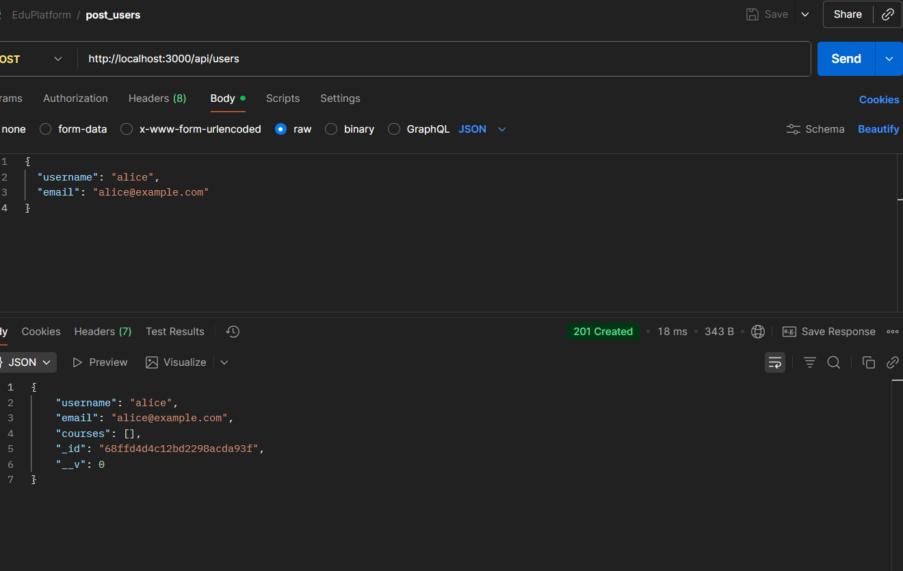
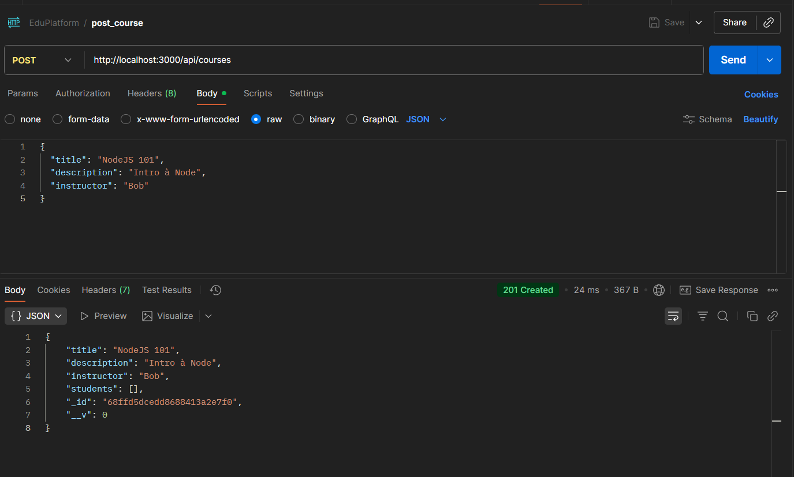
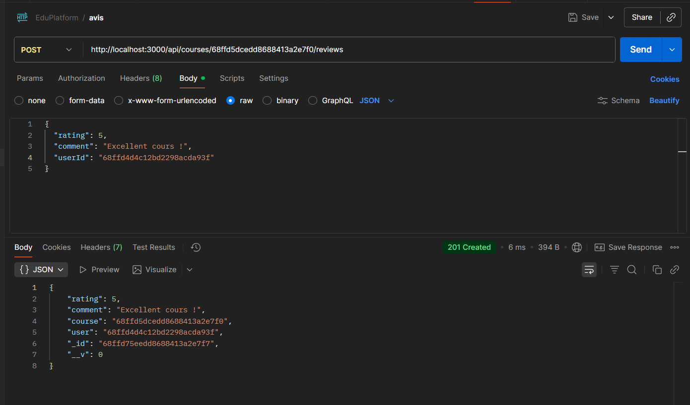

# Cours MERN - Projet Avancé de Mi-Formation
# API pour une Plateforme de Cours en Ligne : Maîtrise des Relations de Données

Ce projet respecte toutes les exigences du TP :

Relations One-to-One (User–Profile)

Many-to-Many (User–Course)

One-to-Many (Course–Review)

CRUD de base pour Users, Profiles, Courses, Reviews

Middleware de gestion d’erreurs

.populate() et asyncHandler utilisés

----
## 🗂️ Structure complète

```pgsql
EduPlatform/
├─ server.js
├─ .env
├─ config/
│   └─ db.js
├─ models/
│   ├─ User.js
│   ├─ Profile.js
│   ├─ Course.js
│   └─ Review.js
├─ controllers/
│   ├─ userController.js
│   ├─ profileController.js
│   ├─ courseController.js
│   └─ reviewController.js
├─ routes/
│   ├─ userRoutes.js
│   └─ courseRoutes.js
└─ middleware/
    └─ errorMiddleware.js
```






