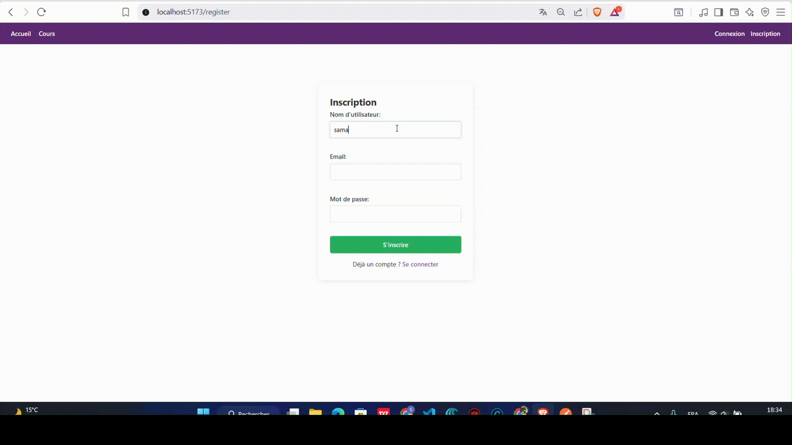
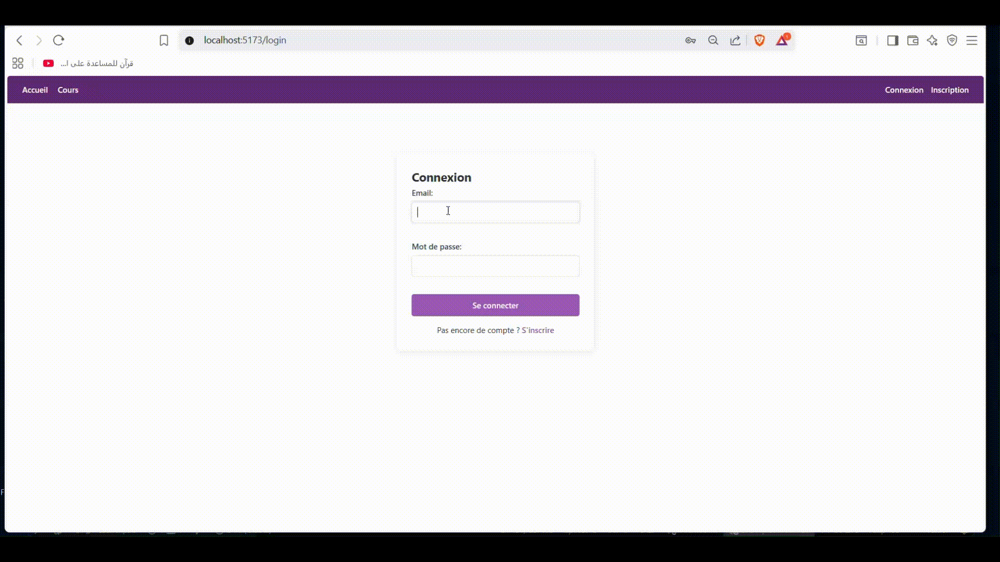
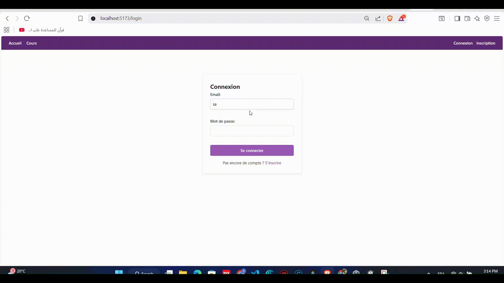
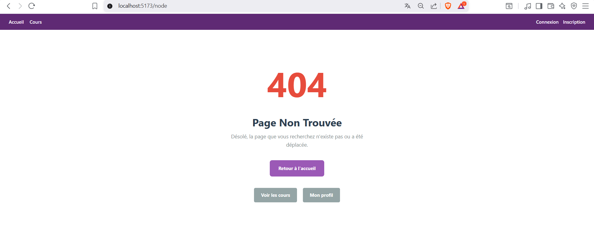

# 🎓 EduPlatform - Plateforme d'Apprentissage Intelligente
----

Application complète de gestion de cours en ligne avec authentification JWT, développée avec la stack MERN (MongoDB, Express, React, Node.js).

----

## 🎬 Démonstration Finale


*Une vue complète de l'application en action.*

----

## 🎬 Fonctionnalités Principales



*Aperçu : inscription, connexion, navigation, recherche/pagination, détails de cours, avis, gestion du profil.*

### ✨ Authentification & Utilisateurs
- ✅ Inscription avec email, username et mot de passe
- ✅ Connexion avec génération de token JWT
- ✅ Protection des routes nécessitant l'authentification
- ✅ Déconnexion sécurisée
- ✅ Profil utilisateur avec bio et site web

### 📚 Gestion des Cours
- ✅ Liste complète des cours disponibles
- ✅ Pagination (10 cours par page)
- ✅ Recherche de cours par titre en temps réel
- ✅ Détails complets d'un cours
- ✅ Inscription à un cours (pour utilisateurs authentifiés)
- ✅ Visualisation des étudiants inscrits

### ⭐ Système d'Avis (Reviews)
- ✅ Ajout d'avis sur un cours (1-5 étoiles + commentaire)
- ✅ Visualisation des avis d'un cours
- ✅ Page "Mes Avis" avec tous les avis de l'utilisateur
- ✅ Suppression des avis

### 👤 Gestion du Profil
- ✅ Affichage du profil utilisateur
- ✅ Édition du profil (bio et site web)
- ✅ Liste des cours auxquels l'utilisateur est inscrit

### 🎨 Interface & Expérience Utilisateur
- ✅ Design moderne avec thème violet
- ✅ Dégradés de couleurs pour les boutons
- ✅ Alertes SweetAlert2 pour les notifications
- ✅ Navigation responsive avec Navbar
- ✅ Page 404 pour les routes inexistantes
- ✅ Loader pendant le chargement des données

-----

## 🤖 Intégration Gemini IA

##### Cours Similaires



#####  Analyse IA des Reviews



*Aperçu : Fonctionnalités d'intelligence artificielle avec Gemini pour enrichir l'expérience utilisateur.*

### ✨ Fonctionnalités IA Disponibles

#### 📊 Analyse Intelligente des Avis
- ✅ Analyse automatique du sentiment des reviews d'un cours
- ✅ Calcul de la note moyenne et tendances
- ✅ Identification des points forts et axes d'amélioration
- ✅ Recommandations personnalisées pour les instructeurs
- ✅ Résumé synthétique en une phrase

#### 📝 Génération de Contenu
- ✅ Création automatique de descriptions de cours attractives
- ✅ Génération de biographies professionnelles personnalisées
- ✅ Contenu optimisé et engageant basé sur les mots-clés

#### 🎯 Recommandations de Cours
- ✅ Suggestions de cours similaires basées sur le contenu
- ✅ Analyse contextuelle pour des recommandations pertinentes
- ✅ Explication détaillée de la pertinence de chaque suggestion

#### 📈 Insights Plateforme (Admin)
- ✅ Analyse globale de la santé de la plateforme
- ✅ Identification des tendances et cours populaires
- ✅ Recommandations stratégiques pour l'amélioration
- ✅ Statistiques détaillées sur l'engagement

### 🔧 Configuration Gemini

Pour utiliser les fonctionnalités IA, ajoutez votre clé API Gemini dans le fichier `.env` :

```env
GEMINI_API_KEY=votre_clé_api_gemini_ici
```

**Obtenir une clé API :**
1. Visitez [Google AI Studio](https://ai.google.dev/)
2. Connectez-vous avec votre compte Google
3. Créez un nouveau projet et générez une clé API
4. Copiez la clé dans votre fichier `.env`

-----
## 🔮 Roadmap & Idées d'Amélioration

### 🚀 Prochaines Fonctionnalités (v2.0)

- [ ] **Dashboard Admin Intelligent** 📊
    - Vue d'ensemble avec insights IA sur toute la plateforme.
    - Analyse des tendances et de l'engagement global.

- [ ] **Générateur de Bio IA** ✍️
    - Assistant de rédaction automatique dans l'édition de profil.
    - Optimisation du profil pour une meilleure visibilité.

- [ ] **Suggestions Personnalisées** 🎯
    - Moteur de recommandation de cours sur mesure.
    - Basé sur l'historique et les préférences de l'utilisateur.

- [ ] **Chatbot Assistant** 💬
    - Interface conversationnelle pour l'aide immédiate.
    - Réponses aux questions fréquentes sur les cours.

- [ ] **Générateur de Quiz Automatique** 📝
    - Création instantanée de quiz d'évaluation.
    - Basé sur l'analyse IA de la description et du contenu du cours.

-----

### 📚 Documentation Complète

Pour plus de détails sur l'utilisation des endpoints IA, consultez :
- [Guide Complet Gemini IA](server/GEMINI_IA_GUIDE.md) - Documentation technique détaillée
- [Guide Postman](server/POSTMAN_GUIDE.md) - Tests des endpoints avec Postman

### 🚀 Endpoints IA Disponibles

| Endpoint | Méthode | Description | Auth |
|----------|---------|-------------|------|
| `/api/ai/analyze-reviews/:courseId` | POST | Analyser les avis d'un cours | ✅ |
| `/api/ai/generate-description` | POST | Générer une description de cours | ✅ |
| `/api/ai/similar-courses/:courseId` | POST | Suggérer des cours similaires | ❌ |
| `/api/ai/generate-bio` | POST | Générer une bio professionnelle | ✅ |
| `/api/ai/platform-insights` | GET | Obtenir les insights plateforme | ✅ |

-----

## 🛠 Technologies Utilisées

### Backend
- **Node.js** - Environnement d'exécution JavaScript
- **Express.js** - Framework web
- **MongoDB** - Base de données NoSQL
- **Mongoose** - ODM pour MongoDB
- **JWT** (jsonwebtoken) - Authentification par token
- **bcryptjs** - Hashage des mots de passe
- **CORS** - Gestion des requêtes cross-origin
- **dotenv** - Gestion des variables d'environnement
- **express-async-handler** - Gestion des erreurs async
- **@google/generative-ai** - Intégration Gemini IA pour fonctionnalités intelligentes

### Frontend
- **React 18** - Bibliothèque UI
- **Vite** - Build tool ultra-rapide
- **React Router** - Gestion du routing
- **Axios** - Client HTTP
- **SweetAlert2** - Alertes modernes
- **CSS moderne** - Dégradés et animations

### Outils de Développement
- 📮 **Postman / Thunder Client** - Tests des APIs REST
- 🔧 **Nodemon** - Rechargement automatique du serveur
- 📦 **npm** - Gestionnaire de paquets Node.js
- 🐙 **Git** - Contrôle de version

----

## 📦 Prérequis

Avant de commencer, assurez-vous d'avoir installé :

- **Node.js** (version 14 ou supérieure)
- **npm** ou **yarn**
- **MongoDB** (local ou MongoDB Atlas)

-----

## 🚀 Installation Rapide

### 1. Cloner le repository

```bash
git clone <repository-url>
cd EduPlatform
```

### 2. Installation des dépendances Backend

```bash
cd server
npm install
```

### 3. Installation des dépendances Frontend

```bash
cd ../client
npm install
```

-----
## ⚙️ Configuration

### Backend (.env)

Créez un fichier `.env` dans le dossier `backend` :

```env
PORT=3000
MONGO_URI=mongodb://localhost:27017/eduplatform
JWT_SECRET=votre_secret_jwt_super_securise_ici
GEMINI_API_KEY=votre_clé_api_gemini_ici
```

**Variables d'environnement:**
- `PORT` : Port du serveur backend (par défaut 3000)
- `MONGO_URI` : URI de connexion MongoDB
- `JWT_SECRET` : Clé secrète pour signer les tokens JWT
- `GEMINI_API_KEY` : Clé API Google Gemini pour les fonctionnalités IA

### Frontend

Le frontend est configuré pour communiquer avec le backend sur `http://localhost:3000/api`.

Configuration dans `client/src/api/axios.js` :

```javascript
const api = axios.create({
  baseURL: 'http://localhost:3000/api'
});
```
-----

## 🎯 Démarrage

### 1. Démarrer MongoDB

Assurez-vous que MongoDB est en cours d'exécution :

```bash
# Si MongoDB est installé localement
mongodb
```

Ou utilisez [MongoDB Atlas](https://www.mongodb.com/cloud/atlas) (cloud gratuit).

### 2. Démarrer le Backend

```bash
cd server
npm start
```

Le serveur démarre sur `http://localhost:3000`

### 3. Démarrer le Frontend

Dans un nouveau terminal :

```bash
cd client
npm run dev
```

Le frontend démarre sur `http://localhost:5173`

### 4. Accéder à l'application

Ouvrez votre navigateur et accédez à :
```
http://localhost:5173
```

----
## 📁 Structure du Projet

```
EduPlatform/
├── server/
│   ├── config/
│   │   ├── db.js                    # Configuration MongoDB
│   │   └── gemini.js                # Configuration Gemini IA
│   ├── controllers/
│   │   ├── authController.js        # Auth (login, register)
│   │   ├── courseController.js      # Gestion des cours
│   │   ├── profileController.js     # Gestion des profils
│   │   ├── reviewController.js      # Gestion des avis
│   │   ├── userController.js        # Gestion des utilisateurs
│   │   └── aiController.js          # Contrôleurs Gemini IA
│   ├── middleware/
│   │   ├── authMiddleware.js        # Middleware JWT (protect)
│   │   └── errorMiddleware.js       # Gestion des erreurs
│   ├── models/
│   │   ├── User.js                  # Modèle Utilisateur
│   │   ├── Course.js                # Modèle Cours
│   │   ├── Profile.js               # Modèle Profil
│   │   └── Review.js                # Modèle Avis
│   ├── routes/
│   │   ├── authRoutes.js            # Routes authentification
│   │   ├── courseRoutes.js          # Routes cours
│   │   ├── userRoutes.js            # Routes utilisateurs
│   │   └── aiRoutes.js              # Routes Gemini IA
│   ├── images/                      # Images/uploads
│   ├── .env                         # Variables d'environnement
│   ├── server.js                    # Point d'entrée backend
│   ├── package.json
│   ├── GEMINI_IA_GUIDE.md           # Guide complet Gemini IA
│   ├── POSTMAN_GUIDE.md             # Guide tests Postman
│   └── README_GEMINI_DOCS.md        # Documentation Gemini
│
├── client/
│   ├── src/
│   │   ├── api/
│   │   │   └── axios.js                # Configuration Axios
│   │   ├── components/
│   │   │   ├── Navbar.jsx              # Barre de navigation
│   │   │   └── ProtectedRoute.jsx      # Route protégée
│   │   ├── context/
│   │   │   └── AuthContext.jsx         # Contexte authentification
│   │   ├── pages/
│   │   │   ├── CourseAnalysis.jsx      # Analyse des cours
│   │   │   ├── GenerateDescription.jsx # Génération description cours
│   │   │   ├── Home.jsx                # Accueil
│   │   │   ├── Login.jsx               # Connexion
│   │   │   ├── Register.jsx            # Inscription
│   │   │   ├── Courses.jsx             # Liste des cours
│   │   │   ├── CourseDetails.jsx       # Détails cours + avis
│   │   │   ├── Profile.jsx             # Profil utilisateur
│   │   │   ├── ProfileEdit.jsx         # Édition profil
│   │   │   ├── MyReviews.jsx           # Mes avis
│   │   │   ├── Reviews.jsx             # Avis
│   │   │   └── NotFound.jsx            # Page 404
│   │   ├── assets/
│   │   │   ├── Video-Project.gif       # Démo projet
│   │   │   └── not_found.png           # Image 404
│   │   ├── App.jsx                     # Composant principal
│   │   ├── App.css                     # Styles (violet theme)
│   │   ├── index.css                   # Styles globaux
│   │   └── main.jsx                    # Point d'entrée
│   ├── index.html
│   ├── vite.config.js
│   └── package.json
│
├── Gemini_IA.gif                    # Démo Gemini IA
└── README.md                        # Documentation principale
```

-----

## 🔌 API Routes

### 🔐 Authentification
| Méthode | Route | Description |
|---------|-------|-------------|
| POST | `/auth/register` | Inscription utilisateur |
| POST | `/auth/login` | Connexion utilisateur |

### 👥 Utilisateurs
| Méthode | Route | Description | Auth |
|---------|-------|-------------|------|
| GET | `/users` | Liste des utilisateurs | ✅ |
| GET | `/users/:id` | Détails utilisateur | ✅ |
| GET | `/users/:userId/courses` | Cours de l'utilisateur | ✅ |
| GET | `/users/:userId/reviews` | Avis de l'utilisateur | ✅ |

### 👤 Profils
| Méthode | Route | Description | Auth |
|---------|-------|-------------|------|
| POST | `/users/:userId/profile` | Créer profil | ✅ |
| GET | `/users/:userId/profile` | Obtenir profil | ✅ |
| PUT | `/users/:userId/profile` | Modifier profil | ✅ |

### 📚 Cours
| Méthode | Route | Description | Auth |
|---------|-------|-------------|------|
| GET | `/courses` | Liste tous les cours | ❌ |
| GET | `/courses/:courseId` | Détails d'un cours | ❌ |
| POST | `/courses` | Créer un cours | ✅ |
| POST | `/courses/:courseId/enroll` | S'inscrire au cours | ✅ |
| GET | `/courses/:courseId/students` | Étudiants du cours | ❌ |

### ⭐ Avis
| Méthode | Route | Description | Auth |
|---------|-------|-------------|------|
| GET | `/courses/:courseId/reviews` | Avis d'un cours | ❌ |
| POST | `/courses/:courseId/reviews` | Ajouter un avis | ✅ |

### 🤖 Gemini IA
| Méthode | Route | Description | Auth |
|---------|-------|-------------|------|
| POST | `/ai/analyze-reviews/:courseId` | Analyser les avis d'un cours | ✅ |
| POST | `/ai/generate-description` | Générer une description de cours | ✅ |
| POST | `/ai/similar-courses/:courseId` | Suggérer des cours similaires | ❌ |
| POST | `/ai/generate-bio` | Générer une bio professionnelle | ✅ |
| GET | `/ai/platform-insights` | Obtenir les insights plateforme | ✅ |

## 📄 Pages Frontend

### Pages Publiques
- **/** - Accueil
- **/login** - Connexion
- **/register** - Inscription
- **/courses** - Liste des cours (recherche + pagination)
- **/courses/:id** - Détails d'un cours

### Pages Protégées (authentification requise)
- **/profile** - Profil utilisateur
- **/profile/edit** - Édition du profil
- **/my-reviews** - Mes avis

### Gestion d'erreur
- **\*** - Page 404 Not Found




---------

## 🎨 Thème & Couleurs

L'application utilise un thème violet moderne avec :
- **Couleur primaire** : `#9b59b6` (Violet)
- **Couleur primaire hover** : `#8e44ad` (Violet foncé)
- **Couleur succès** : `#27ae60` (Vert)
- **Couleur danger** : `#e74c3c` (Rouge)

Tous les boutons et éléments interactifs utilisent des **dégradés de couleurs** pour une apparence premium.

-----

## 🔐 Authentification & Sécurité

### Flux d'authentification
1. L'utilisateur s'inscrit ou se connecte
2. Un token JWT est généré et stocké dans le localStorage
3. Le token est envoyé dans le header `Authorization: Bearer <token>`
4. Le middleware `protect` vérifie le token avant d'accéder aux routes protégées
5. L'ID utilisateur est extrait du token et utilisé pour les opérations

### Mesures de sécurité
- ✅ Mots de passe hashés avec **bcryptjs**
- ✅ Routes sensibles protégées par **JWT middleware**
- ✅ Tokens JWT stockés dans localStorage côté client
- ✅ CORS configuré pour accept uniquement le frontend
- ✅ Validation des données côté serveur

-------

## 📦 Modèles de Données

### Utilisateur
```javascript
{
  username: String (unique),
  email: String (unique),
  password: String (hashé),
  courses: [ObjectId (ref: Course)],
  createdAt: Date
}
```

### Cours
```javascript
{
  title: String,
  description: String,
  instructor: String,
  students: [ObjectId (ref: User)],
  createdAt: Date
}
```

### Profil
```javascript
{
  bio: String,
  website: String,
  user: ObjectId (ref: User),
  createdAt: Date
}
```

### Avis
```javascript
{
  rating: Number (1-5),
  comment: String,
  course: ObjectId (ref: Course),
  user: ObjectId (ref: User),
  createdAt: Date
}
```
----

## 🐛 Dépannage

### Le backend ne démarre pas
```bash
✓ Vérifiez que MongoDB est en cours d'exécution
✓ Vérifiez le fichier .env est bien configuré
✓ Vérifiez que le port 3000 n'est pas utilisé
✓ Installez les dépendances : npm install
```

### Le frontend ne se connecte pas au backend
```bash
✓ Vérifiez que le backend démarre sur le port 3000
✓ Vérifiez la configuration CORS dans server.js
✓ Vérifiez l'URL de base dans axios.js
✓ Ouvrez la console navigateur pour voir les erreurs
```

### Erreur "Vous devez être inscrit au cours pour laisser un avis"
```bash
✓ Assurez-vous d'être inscrit au cours avant d'ajouter un avis
✓ Actualisez la page pour voir l'état d'inscription mis à jour
```

### Les reviews ne s'affichent pas
```bash
✓ Vérifiez que vous êtes authentifié
✓ Vérifiez que le token JWT est valide
✓ Vérifiez les erreurs dans la console navigateur
```

------

## 📚 Exemples de Cours à Créer

1. **Node.js 101** - Introduction à Node.js et Express
2. **Performance React** - Optimisation des performances React
3. **MongoDB Avancé** - Requêtes complexes et agrégations
4. **Docker Essentials** - Containerisation d'applications
5. **GraphQL Basics** - Alternative à REST API


------

## 👨‍💻 Auteur

*Samah SAIDI*
Développé pour le cours MERN - Plateforme EduPlatform

----

## 📝 Licence

Ce projet est à des fins éducatives.

---


