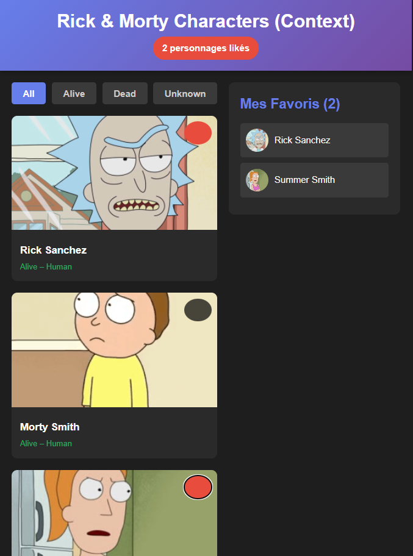
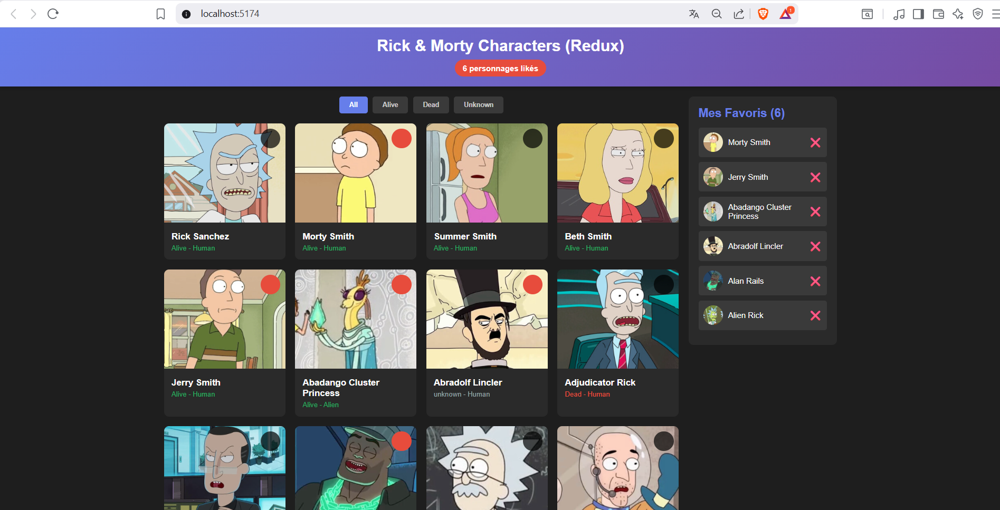
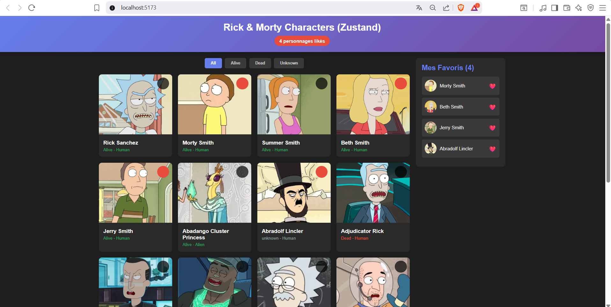

# 🧭 README – Comparaison complète : useContext vs Redux Toolkit vs Zustand

*“Trois approches, trois philosophies. Une seule mission : gérer l’état global efficacement.”*

Dans une application React moderne, gérer l’état global est souvent essentiel : favoris, filtres, utilisateur connecté, données API partagées…
Plusieurs solutions existent. Ce README compare les trois utilisées dans ce projet :

- useContext – Simple, intégré à React

- Redux Toolkit – Complet, robuste, industriel

- Zustand – Minimaliste, performant, élégant

---------

## 🌟 1. Concept général
### 🔵 useContext

Outil natif de React permettant de partager un état global sans passer par du prop drilling.
Parfait pour les petites apps ou les états simples (thème, utilisateur, paramètres…).

### 🔴 Redux Toolkit

La version moderne de Redux.
Idéal pour les applications complexes : structure stricte, gestion avancée des API, devtools puissants.

### 🟠 Zustand

State management minimaliste basé sur des stores indépendants.
Très léger, ultra rapide, aucune configuration, aucun provider.

## 🧪 2. Approche Technique
| Critère      | useContext | Redux Toolkit                                 | Zustand                   |
|--------------|------------|-----------------------------------------------|---------------------------|
| Installation | Rien       | `npm install @reduxjs/toolkit react-redux`    | `npm install zustand`     |
| API Async    | useEffect  | createAsyncThunk                              | simple fonction async     |
| Structure    | Libre      | Strict / slices                               | Flexible                  |
| Provider     | ✔️ Oui     | ✔️ Oui                                        | ❌ Non                    |
| Rerenders    | ⚠️ souvent | Très contrôlés                                | Très optimisés            |
| Devtools     | ❌         | ✔️ excellents                                  | ✔️ (plugin optionnel)     |

---------

## 📦 3. Exemple Résumé de Code
### 🔵 useContext

**Création du context**
```jsx
const AppContext = createContext();

export const AppProvider = ({ children }) => {
  const [value, setValue] = useState("Hello");
  return (
    <AppContext.Provider value={{ value, setValue }}>
      {children}
    </AppContext.Provider>
  );
};

export const useApp = () => useContext(AppContext);
```

**Utilisation**
```jsx
const { value } = useApp();
```

**Résultat**


-----

### 🔴 Redux 

**Slice**
```jsx
const appSlice = createSlice({
  name: "app",
  initialState: { value: "Hello" },
  reducers: {
    setValue: (state, action) => { state.value = action.payload; }
  }
});
export const { setValue } = appSlice.actions;
export default appSlice.reducer;
```

**Store**
```jsx
export const store = configureStore({
  reducer: { app: appReducer }
});
```

**Utilisation**
```jsx
const value = useSelector(state => state.app.value);
dispatch(setValue("Hi"));
```

**Résultat**


----

### 🟠 Zustand

**Store**
```jsx
const useAppStore = create(set => ({
  value: "Hello",
  setValue: (v) => set({ value: v })
}));
```

**Utilisation**
```jsx
const value = useAppStore(state => state.value);
```

Aucun provider requis.

**Résultat**


--------

## 🧠 4. Points forts & faiblesses
### 🔵 useContext
##### ✔ Avantages

- Intégré à React

- Facile à comprendre

- Parfait pour un état global simple

##### ❌ Faiblesses

- Re-renders nombreux

- Pas adapté aux grosses apps

- Gestion des API moins propre

### 🔴 Redux Toolkit
##### ✔ Avantages

- Structure claire

- Devtools puissants

- Gestion API idéale (createAsyncThunk)

- Stable et industriel

##### ❌ Faiblesses

- Plus verbeux

- Peut être “overkill” pour petits projets

### 🟠 Zustand
##### ✔ Avantages

- Le plus simple

- Aucun provider

- Performances extraordinaires

- Idéal pour apps légères et moyennes

##### ❌ Faiblesses

- Peu de règles → risque de désorganisation

- Moins adapté aux énormes équipes structurées

- Moins d’outils out-of-the-box que Redux

---------

## 🏁 5. Quand utiliser quoi ?
| Taille du projet            | Solution recommandée |
|-----------------------------|-----------------------|
| Très petit                  | useContext            |
| Petit / moyen               | Zustand               |
| Moyen / grand               | Redux Toolkit         |
| Entreprise / longue durée   | Redux Toolkit         |
| Projet perso rapide         | Zustand               |
| App UI simple               | useContext            |

--------

## 6. Comparaison Détaillée

### 📊 Tableau Comparatif

| Critère | **useContext** | **Redux Toolkit** | **Zustand** |
|---------|----------------|-------------------|-------------|
| **Setup** | Provider obligatoire | Provider + Store + Slice | Juste create() |
| **Boilerplate** | Moyen (~80 lignes) | Élevé (~100 lignes) | Minimal (~60 lignes) |
| **Courbe d'apprentissage** | Facile | Difficile | Très facile |
| **Performance** | ⚠️ Re-renders fréquents | ✅ Optimisé avec selectors | ✅ Optimisé automatiquement |
| **Async** | useEffect manuel | createAsyncThunk élégant | async/await direct |
| **DevTools** | ❌ Non | ✅ Redux DevTools | ✅ Extension Zustand |
| **Taille bundle** | 0 KB (natif) | ~11 KB | ~1 KB |
| **Middleware** | ❌ Non | ✅ Oui (thunk, saga, etc.) | ✅ Oui (léger) |
| **TypeScript** | Bon | Excellent | Excellent |
| **Sélection partielle** | ❌ Non (tout le context) | ✅ Oui (useSelector) | ✅ Oui (auto) |

--------

## 📐 7. Résultat Final : Comparaison Synthétique

| Critère        | Context | Redux | Zustand |
|----------------|---------|-------|---------|
| Lignes de code | ⭐⭐      | ⭐⭐⭐   | ⭐⭐⭐⭐    |
| Performance    | ⭐⭐      | ⭐⭐⭐⭐  | ⭐⭐⭐⭐⭐   |
| Apprentissage  | ⭐⭐⭐⭐    | ⭐⭐    | ⭐⭐⭐⭐    |
| API async      | simple  | excellent | simple |
| Architecture   | libre   | stricte | flexible |
| Idéal pour     | simple  | complexe | moyen  |


-----

## ✨ 8. Conclusion

Chaque solution répond à un besoin différent :

- useContext → parfait pour centraliser un petit état rapidement

- Redux Toolkit → l’option la plus robuste et scalable

- Zustand → simplicité maximale + performance top-tier

Ce projet t’a permis de manipuler les trois pour bien comprendre :

- Leur philosophie

- Leur structure

- Leurs forces

- Leurs limites


-----------

## 📚 9. Ressources
### 🚀 Documentation officielle

*React – useContext*
https://react.dev/reference/react/useContext

*Redux Toolkit*
https://redux-toolkit.js.org/

*Zustand
*https://zustand-demo.pmnd.rs/

🌐 API utilisée dans le projet

**Rick & Morty API**
https://rickandmortyapi.com/api/character

#### 📄 Support du cours

Cours MERN – Semaine 8 (PDF fourni)

------

## ✒️ 10. Auteur

**Samah SAIDI**

---

*Projet réalisé dans le cadre du cours MERN – Gestion d’État Globale (Semaine 8).*