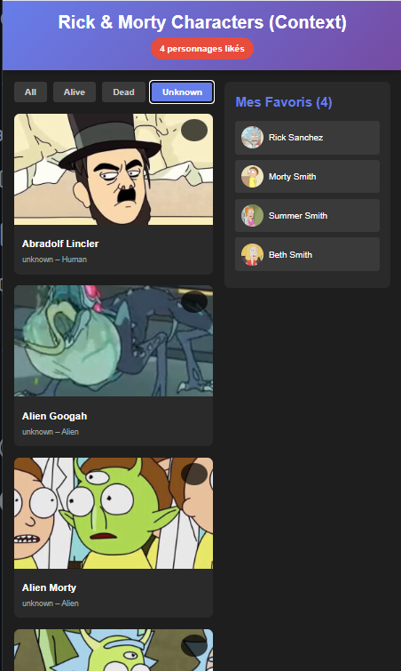
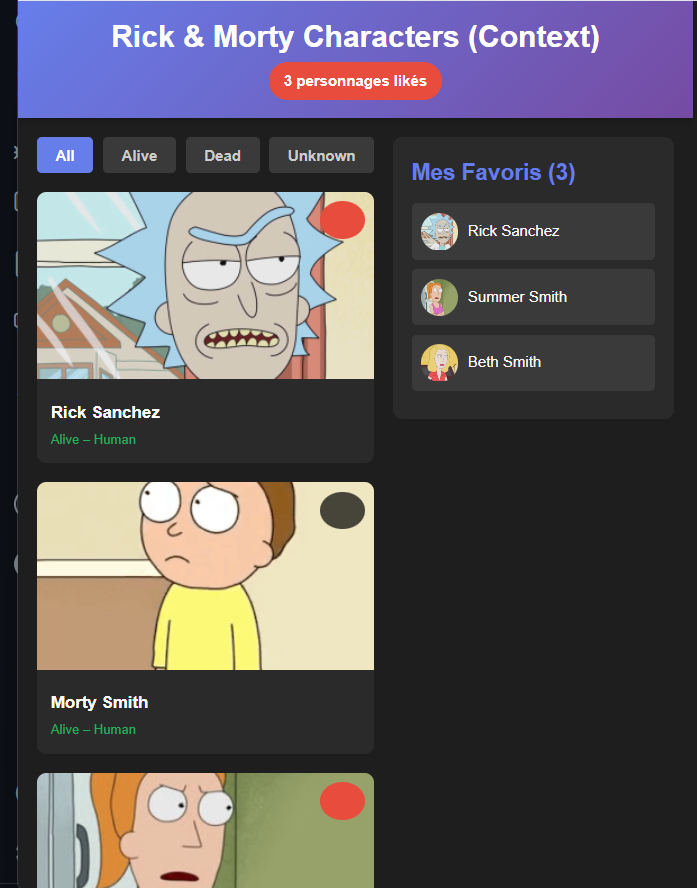

## 🌌 useContext 
*“Parce qu’entrepropager des props à travers 7 composants, c’est du multivers inutile.”*

### 🎯 Objectifs

- Pourquoi le prop drilling est un problème.

- Comment créer, configurer et consommer un Context en React.

- Comment l’utiliser dans un vrai projet : une galerie de personnages Rick & Morty avec likes, filtres, favoris, etc.

- Les bonnes pratiques, pièges à éviter et optimisation.

--------

#### 🧩 1. Le Problème : Prop Drilling (et pourquoi useContext existe)

Imagine que tu veux passer une donnée simple (ex : username) mais ton composant final se situe 5 niveaux plus bas.
```jsx
function App() {
  const [username, setUsername] = useState("Alice");

  return (
    <Header username={username}>
      <Navbar username={username}>
        <UserMenu username={username} /> {/* Enfin utilisé ici */}
      </Navbar>
    </Header>
  );
}
```

**❌ Problème :**
Tu fais transiter une donnée à travers des composants qui n’en ont rien à faire.
C’est du bruit, du code inutile, et ça rend ton app difficile à maintenir.

**➡️ Solution : un état global accessible directement là où il est utilisé.**
**➡️ C’est là que useContext entre en scène.**

#### 🧠 2. useContext : Le GPS de ton État Global

useContext permet de :

-  Créer un “contexte” (un espace de stockage partagé)

-  Exposer cet état à n’importe quel composant

-  Sans prop drilling

-  Et sans installer de librairie externe

##### 🏗️ Étape 1 — Créer le Context
```jsx
import { createContext, useContext, useState } from "react";

const UserContext = createContext();

export const UserProvider = ({ children }) => {
  const [username, setUsername] = useState("Alice");

  return (
    <UserContext.Provider value={{ username, setUsername }}>
      {children}
    </UserContext.Provider>
  );
};

export const useUser = () => useContext(UserContext);
```

✔️ On crée un provider
✔️ On stocke l’état
✔️ On expose l’état via value
✔️ On crée un hook personnalisé useUser() → propre et ergonomique

#### 🌐 3. Intégration dans l'application

Dans main.jsx :
```jsx
<UserProvider>
  <App />
</UserProvider>
```

*Tous les composants à l’intérieur → accès direct à username.*

#### 👤 4. Consommer le Context
```jsx
function UserMenu() {
  const { username } = useUser();
  return <div>Bonjour {username} !</div>;
}
```

*Simple. Propre. Sans intermédiaires.*

------

#### 🧪 5. useContext : Exemple Le projet : Galerie Rick & Morty

**Fonctionnalités :**

-  Chargement des personnages via API

-  Gestion des likes

-  Filtrage (alive/dead/unknown)

-  Liste des favoris

-  Affichage du total de likes dans le header

##### 💾 Création du CharactersContext
```jsx
import { createContext, useContext, useState, useEffect } from 'react';

const CharactersContext = createContext();

export const useCharacters = () => {
    const context = useContext(CharactersContext);
    if (!context) {
        throw new Error('useCharacters must be used within a CharactersProvider');
    }
    return context;
}

export const CharactersProvider = ({ children }) => {
    const [characters, setCharacters] = useState([]);
    const [likedIds, setLikedIds] = useState([]);
    const [filter, setFilter] = useState('all');
    const [loading, setLoading] = useState(true);

    // Charger les personnages
    useEffect(() => {
        fetch('https://rickandmortyapi.com/api/character')
            .then(res => res.json())
            .then(data => {
                setCharacters(data.results);
                setLoading(false);
            });
    }, []);

    const toggleLike = (id) => {
        setLikedIds(prev =>
            prev.includes(id)
                ? prev.filter(likedId => likedId !== id)
                : [...prev, id]
        );
    };

    const getLikedCharacters = () => {
        return characters.filter(char => likedIds.includes(char.id));
    };

    const getFilteredCharacters = () => {
        if (filter === 'all') return characters;
        return characters.filter(char => char.status.toLowerCase() === filter);
    };

    const value = {
        characters,
        likedIds,
        filter,
        loading,
        toggleLike,
        setFilter,
        getLikedCharacters,
        getFilteredCharacters,
    };

    return (
        <CharactersContext.Provider value={value}>
            {children}
        </CharactersContext.Provider>
    );
};
```

--------------
##### 🧩 6. Utilisation dans les composants
**🎆 Header : afficher le nombre de likes**
```jsx
import { useCharacters } from '../context/CharactersContext';

function Header() {
    const { likedIds } = useCharacters();

    return (
        <header className="header">
                <h1>Rick & Morty Characters (Context) </h1>
                <div className="likes-badge">
                    {likedIds.length} personnages likés 
                </div>
            </header>
    );
}

export default Header;
```

**🎛️ FilterBar : filtrer les personnages**
```jsx
import { useCharacters } from '../context/CharactersContext';

function FilterBar() {
    const { filter, setFilter } = useCharacters();

    const filters = ['all', 'alive', 'dead', 'unknown'];

    return (
        <div className="filter-bar">
            {filters.map(f => (
                <button
                    key={f}
                    className={`filter-btn ${filter === f ? 'active' : ''}`}
                    onClick={() => setFilter(f)}
                >
                    {f.charAt(0).toUpperCase() + f.slice(1)}
                </button>
            ))}
        </div>
    );
}

export default FilterBar;
```


**🧱 CharacterGrid : appliquer filtre + loading**

```jsx
import { useCharacters } from '../context/CharactersContext';
import CharacterCard from './CharacterCard';

function CharacterGrid() {
    const { getFilteredCharacters, loading } = useCharacters();

    if (loading) {
        return <div className="loading">Chargement...</div>;
    }

    const filteredCharacters = getFilteredCharacters();

    return (
        <div className="character-grid">
            {filteredCharacters.map(character => (
                <CharacterCard key={character.id} character={character} />
            ))}
        </div>
    );
}

export default CharacterGrid;
```

**❤️ FavoritesSidebar : liste dynamique des favoris**

```jsx
import { useCharacters } from '../context/CharactersContext';

function FavoritesSidebar() {
    const { getLikedCharacters, toggleLike } = useCharacters();
    const likedCharacters = getLikedCharacters();

    return (
        <div className="favorites-sidebar">
            <h2>Mes Favoris ({likedCharacters.length})</h2>

            {likedCharacters.length === 0 ? (
                <p style={{ color: '#95a5a6' }}>Aucun favori</p>
            ) : (
                likedCharacters.map(character => (
                    <div key={character.id} className="favorite-item">
                        
                        <span>{character.name}</span>
                        <button
                            onClick={() => toggleLike(character.id)}
                            style={{
                                marginLeft: 'auto',
                                background: 'none',
                                border: 'none',
                                cursor: 'pointer',
                                fontSize: '20px'
                            }}
                        >
                            
                        </button>
                    </div>
                ))
            )}
        </div>
    );
}

export default FavoritesSidebar;
```



-----
##### ⚙️ 7. Avantages & Limites de useContext

*✔️ Avantages*

-  Très simple à mettre en place

-  Aucun package externe

-  Parfait pour petites/moyennes apps

- Excellent pour partager :

  - utilisateur

  - thème

  - paramètres

  - panier léger

  - favoris

  - filtres

**❌ Limites**

⚠️ Chaque changement → re-render de tous les consommateurs

Pas idéal pour de très grands états ou états très fréquent-changing

Pas de middleware, pas de devtools (contrairement à Redux)

-------------
##### ⭐ 8. Best Practices (à connaître absolument)
*✔️ Toujours créer un hook comme useCharacters ou useUser*

     → Évite les imports compliqués, augmente la lisibilité.

*✔️ Découper le Context si nécessaire*

    Un gros context = beaucoup de re-renders.
    Préférer plusieurs contexts ciblés.

*✔️ Ne jamais mettre des composants lourds dans value*

❌

    value={{ data, bigFunction: () => {...} }}


✔️

    const bigFunction = useCallback(() => {...}, []);
    value={{ data, bigFunction }}

----------
##### 🎉 Conclusion

useContext est la solution parfaite pour :

- Simplifier la gestion d’état global

- Éviter le prop drilling

- Garder une architecture claire

- Partager des états simples à moyens

- Construire rapidement une app moderne (comme ta galerie Rick & Morty)

*Pour des applis plus lourdes ou très dynamiques :*
*➡️ Redux Toolkit ou Zustand seront mieux adaptés.*