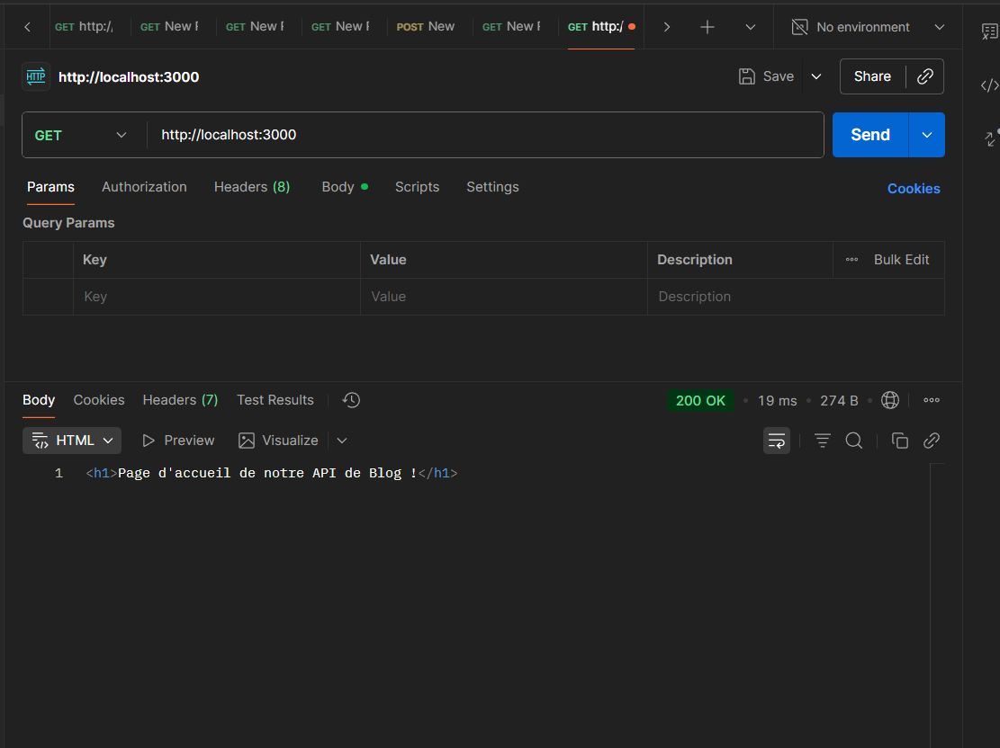
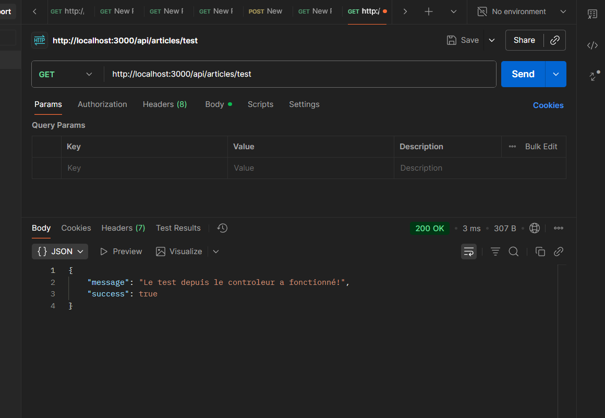
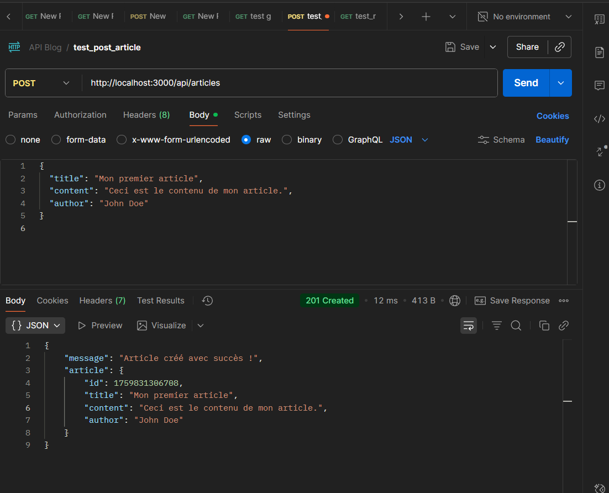
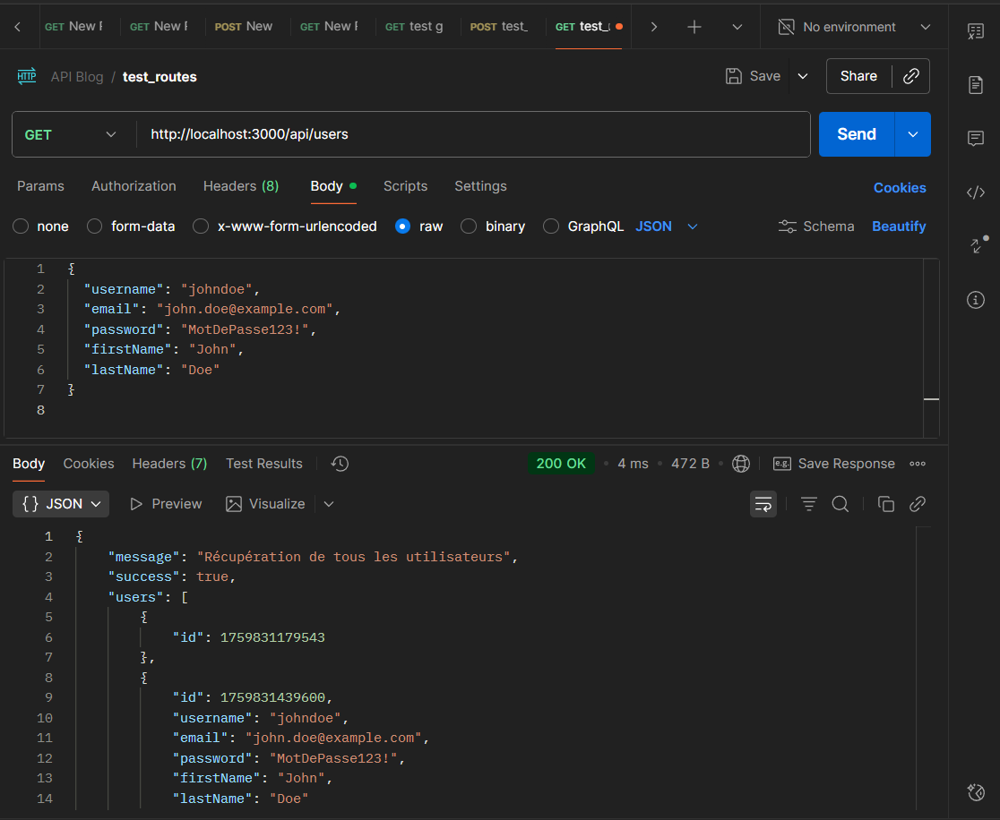
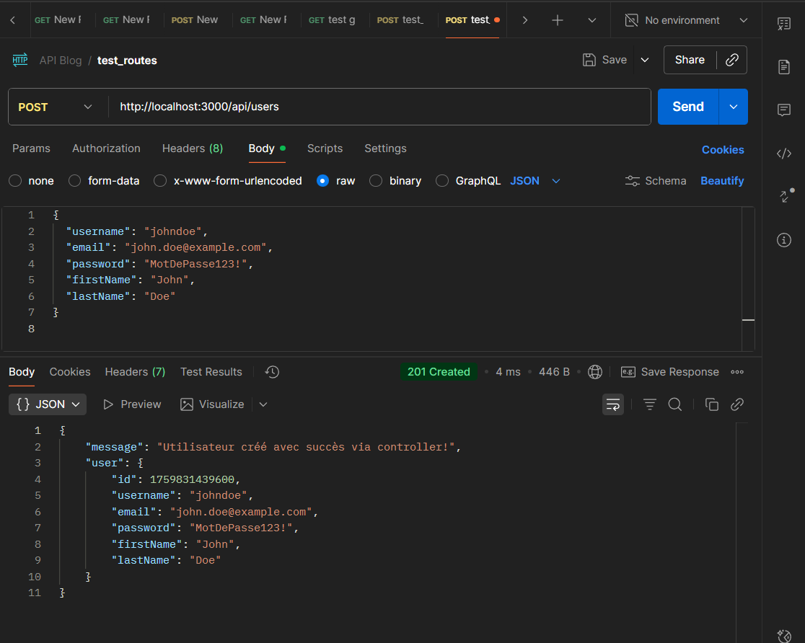

# 🚀 MERN – Semaine 2 : Structuration de l’API avec Routes et Contrôleurs

👨‍💻 Formateur : Abdelweheb GUEDDES 
🏫 École : École Polytechnique Sousse
---

# 🎯 Objectifs Pédagogiques

Cette semaine, nous passons d’un simple serveur Express à une architecture d’API professionnelle et modulaire.

# 🧰 Prérequis

Node.js (>=14) et npm installés

Connaissances basiques Express.js

(Optionnel) nodemon pour reloader automatiquement : npm i -D nodemon

# ⚡ Installation rapide (setup initial)
```bash
# Créer le dossier du projet
mkdir mon-api-blog
cd mon-api-blog

# initialiser npm
npm init -y

# installer express
npm install express

# (optionnel) nodemon en dev
npm install -D nodemon
```

Dans package.json tu peux ajouter un script dev :
```json
"scripts": {
  "start": "node server.js",
  "dev": "nodemon server.js"
}
```

📁 Arborescence cible
```bash
mon-api-blog/
├── controllers/
│   ├── articleController.js
│   └── userController.js      <-- TP complémentaire
├── routes/
│   ├── articleRoutes.js
│   └── userRoutes.js          <-- TP complémentaire
├── server.js
└── package.json
```

---

# Partie A — LE TP : Refactorisation des Articles  → 🗂️
## Étape 1 : Préparation de l’Architecture
```bash
mkdir controllers
mkdir routes
```

## ⚙️ Étape 2 : Création du Contrôleur d’Articles

### ⚙️ Créer le contrôleur controllers/articleController.js
```js
// controllers/articleController.js

// Contrôleur pour la route de test
const testApi = (req, res) => {
  res.status(200).json({
    message: 'Le test depuis le contrôleur Articles a fonctionné ! 🚀',
    success: true
  });
};

// Contrôleur pour créer un article
const createArticle = (req, res) => {
  const articleData = req.body;
  console.log('📝 Données reçues :', articleData);

  res.status(201).json({
    message: 'Article créé avec succès via le contrôleur ! ✅',
    article: { id: Date.now(), ...articleData }
  });
};

module.exports = { testApi, createArticle };

```
## 🚦 Étape 3 : Création du Routeur d’Articles 

### 🚦 Créer le routeur routes/articleRoutes.js
```js
// routes/articleRoutes.js
const express = require('express');
const router = express.Router();
const { testApi, createArticle } = require('../controllers/articleController');

// GET /api/articles/test
router.get('/test', testApi);

// POST /api/articles
router.post('/', createArticle);

module.exports = router;

```

## Étape 4 : Mettre à jour le Serveur Principal 🧠 server.js

```js
const express = require('express');
const app = express();
const PORT = 3000;
const articleRoutes= require('./routes/articleRoutes');
const userRoutes = require('./routes/userRoutes');

// --- Middleware JSON ---
app.use(express.json());

// --- Routes GET ---
app.get('/', (req, res) => {
    res.status(200).send('<h1>Page d\'accueil de notre API de Blog !</h1>');
});

// --- Routes Articles ---
app.use('/api/articles', articleRoutes);

// --- Routes Users ---
app.use('/api/users', userRoutes);


// --- Route À Propos ---
app.get('/about', (req, res) => {
  res.status(200).send('<h1>À Propos</h1><p>Ceci est une API de blog développée avec Node.js et Express.js dans le cadre du cours MERN.</p>');
});

// --- Route API Users ---
app.get('/api/users',);


// --- Route Contact POST (Travail Pratique 3) ---
app.post('/contact', (req, res) => {
  const { email, message } = req.body;
  
  // Validation des champs requis
  if (!email || !message) {
    return res.status(400).json({
      success: false,
      message: 'L\'email et le message sont requis!'
    });
  }
  
  // Validation simple de l'email
  const emailRegex = /^[^\s@]+@[^\s@]+\.[^\s@]+$/;
  if (!emailRegex.test(email)) {
    return res.status(400).json({
      success: false,
      message: 'Format d\'email invalide!'
    });
  }
  
  console.log('Message de contact reçu:', { email, message });
  
  res.status(200).json({
    success: true,
    message: `Message reçu de ${email}!`,
    data: {
      email: email,
      receivedAt: new Date().toISOString()
    }
  });
});

// --- Gestion des routes non trouvées (404) ---
app.use((req, res) => {
  res.status(404).json({
    success: false,
    message: 'Route non trouvée'
  });
});

// --- Lancement du serveur ---
app.listen(PORT, () => {
    console.log(`Serveur démarré sur http://localhost:${PORT}`);  
});
```

## Étape 5 : 🧪 Validation avec Postman

#### ▶️ Lancement du Serveur
```bash
npm run dev   # Mode Développement (avec auto-reload)
# ou npm start  #Mode Production
```

Résultat attendu

```bash
`Serveur démarré sur http://localhost:3000`
``` 

##### 📍 Routes GET
1. Route Racine /
URL : http://localhost:3000/
Méthode : GET
Réponse : HTML (page d'accueil)

Résultat attendu


2. Route Test /api/test
URL : http://localhost:3000/api/article/test
Méthode : GET
Réponse : JSON

Résultat attendu


#####  📮 Routes POST
1. Créer un Article /api/articles
URL : http://localhost:3000/api/articles
Méthode : POST
Headers : Content-Type: application/json
Body (raw JSON) :
```json
{
  "title": "Mon premier article",
  "content": "Ceci est le contenu de mon article.",
  "author": "John Doe"
}

```
Résultat attendu


# Partie B — TRAVAIL PRATIQUE COMPLÉMENTAIRE : Users 👥

### Étape 1 — controllers/userController.js
```js
const users = [];
const getAllUsers = (req, res) => {
  res.status(200).json({ message: "Récupération de tous les utilisateurs", success: true, users });
}

const createUser = (req, res) => {
  const userData = req.body;
    console.log('Données reçues par le controller:', userData);
    users.push({ id: Date.now(), ...userData });
    res.status(201).json({
      message: 'Utilisateur créé avec succès via controller!',
        user: { id: Date.now(), ...userData }
    });
}

module.exports = { getAllUsers, createUser };
```

### Étape 2 — routes/userRoutes.js

```js
const express = require('express');
const router = express.Router();
const { getAllUsers,createUser} = require('../controllers/userController');

router.get('/', getAllUsers);
router.post('/', createUser);

module.exports = router;
```

### Étape 3 — Brancher dans server.js

Modifie 🧠 server.js pour importer et utiliser userRoutes :
```js
// en haut de server.js
const userRoutes = require('./routes/userRoutes');

// ... après app.use('/api/articles', articleRoutes);
app.use('/api/users', userRoutes);
```

### Étape 4 — Tester Users 

1. Route getAllUsers /api/users
URL : http://localhost:3000/api/users
Méthode : GET
Réponse : JSON

Résultat attendu



2. Créer un User /api/users
URL : http://localhost:3000/api/users
Méthode : POST
Headers : Content-Type: application/json
Body (raw JSON) :
```json
{
  "username": "johndoe",
  "email": "john.doe@example.com",
  "password": "MotDePasse123!",
  "firstName": "John",
  "lastName": "Doe"
}
```
Résultat attendu



## 📊 Codes Status HTTP Utilisés

| Code | 🧩 Signification | 💡 Utilisation dans le projet |
|:----:|:-----------------|:-----------------------------|
| **200** | ✅ OK | Requête **GET** réussie (ex : récupération d’articles ou d’utilisateurs) |
| **201** | 🆕 Created | Ressource créée avec succès (**POST** article ou utilisateur) |
| **400** | ⚠️ Bad Request | Données manquantes ou invalides (version améliorée à venir) |
| **404** | ❌ Not Found | Route inexistante ou ressource introuvable |
| **500** | 💥 Internal Server Error | Erreur serveur (exception non gérée ou problème interne) |

