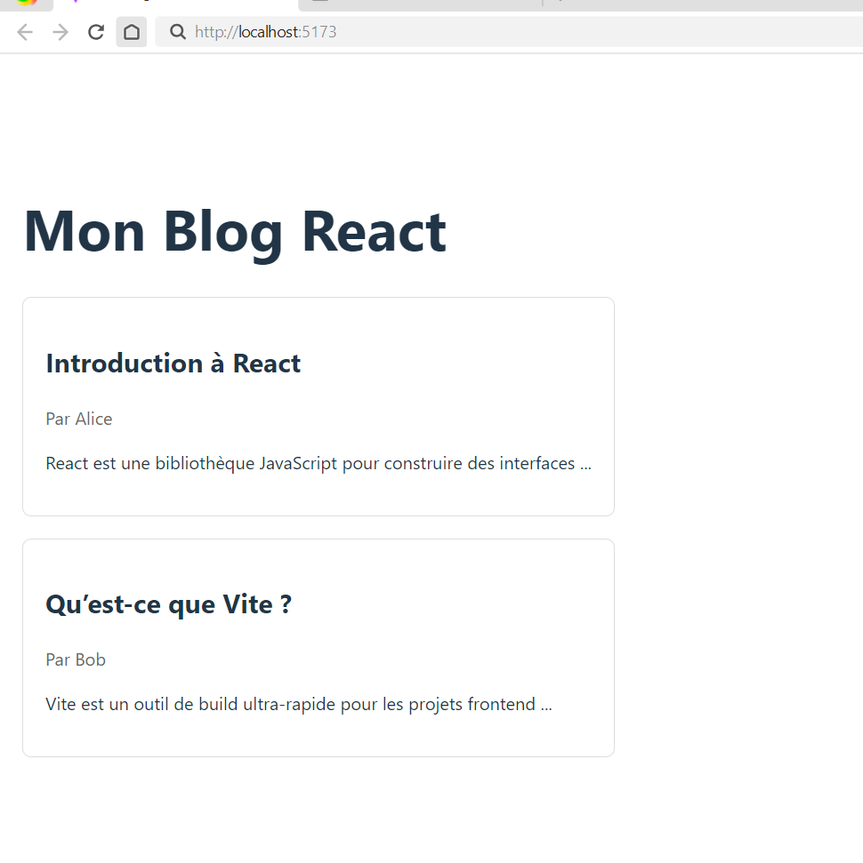
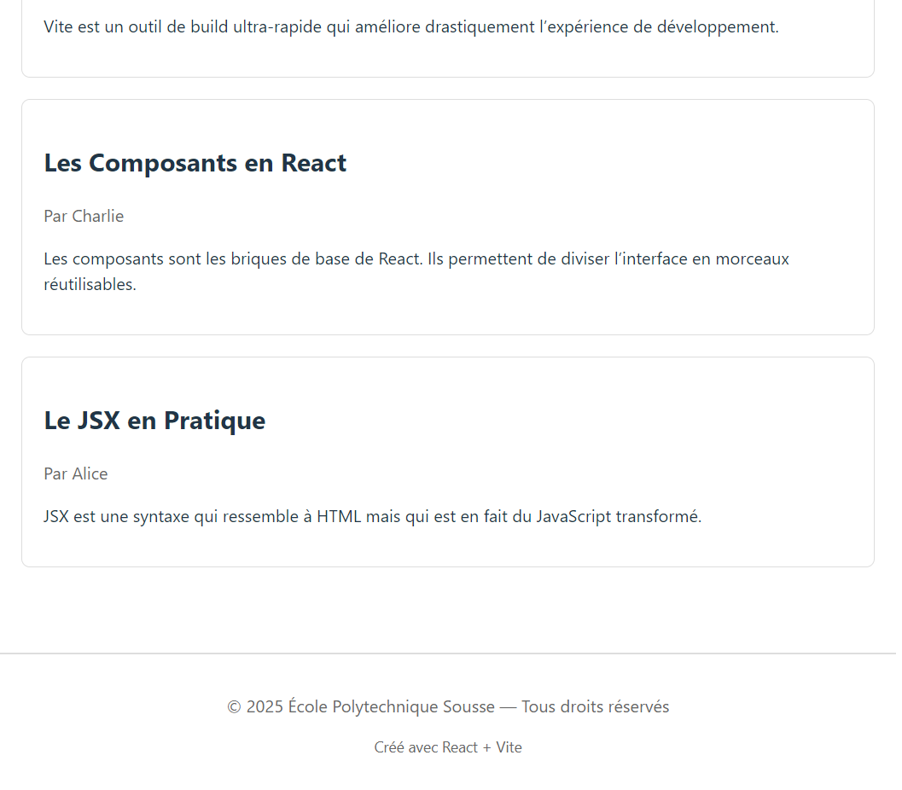
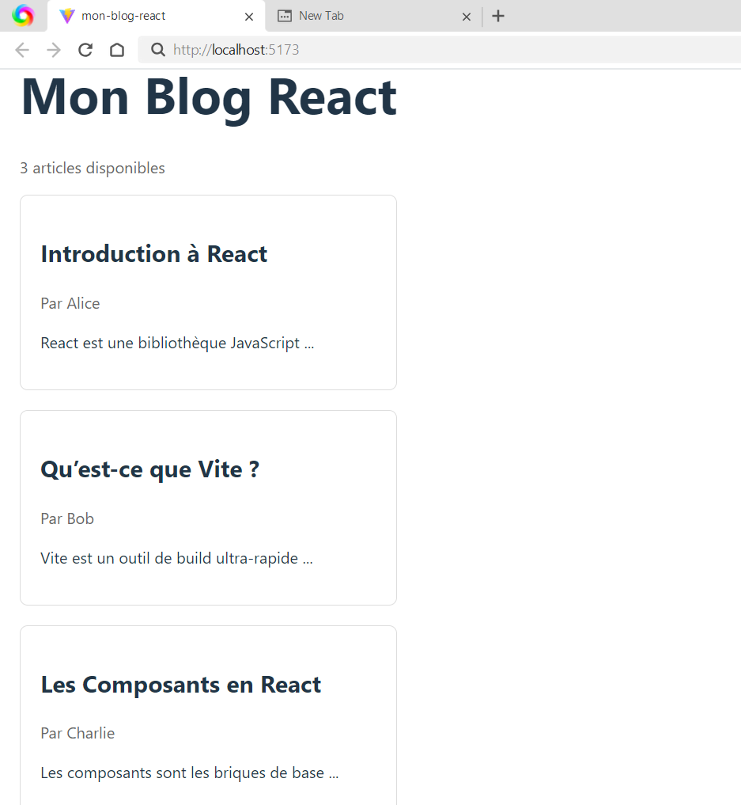
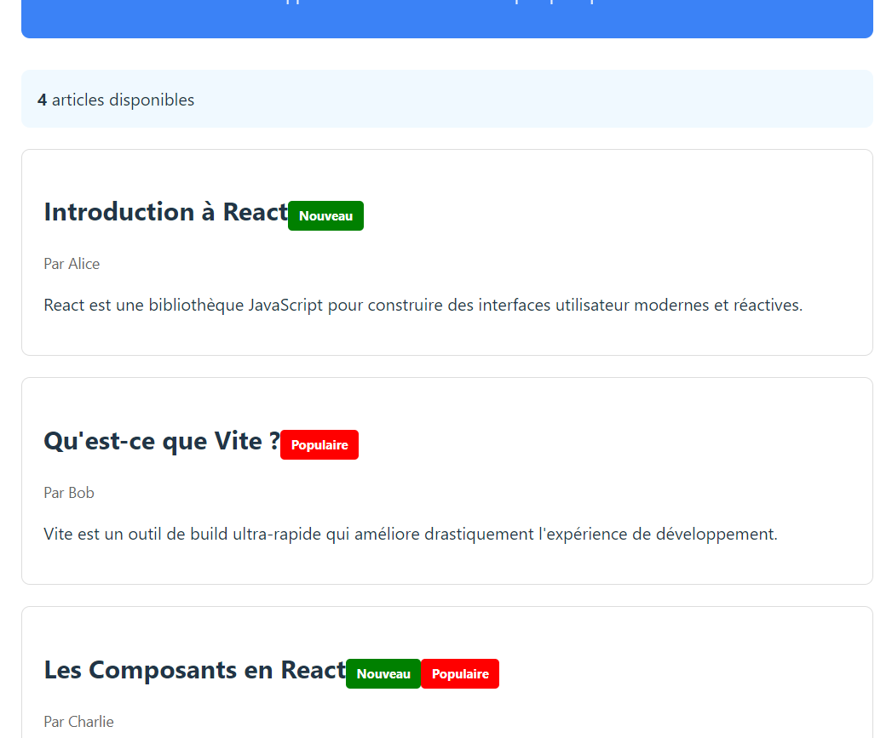

# 📘 Cours MERN -- Semaine 6 : Introduction à React et Vite

**École Polytechnique Sousse**\
**Formateurs : Abdelweheb Gueddes**\
🗓️ *27 octobre 2025*

------------------------------------------------------------------------

## 🎯 Objectifs Pédagogiques

- Comprendre la différence entre une **MPA (Multi-Page Application)** et une **SPA (Single Page Application)** 

- Expliquer le rôle de **React** dans le développement frontend moderne 

- Maîtriser la syntaxe **JSX** 

- Créer des **composants réutilisables** 

- Utiliser les **props** pour communiquer entre composants 

- Initialiser un projet React avec **Vite** 

- Afficher des listes dynamiques avec `.map()` 

- Structurer une application React selon les bonnes pratiques

------------------------------------------------------------------------

## 🧠 Partie 1 --- Concepts Théoriques

### ⚙️ 1. MPA vs SPA

    MPA (Multi-Page App)                     SPA (Single-Page App)
    ┌────────────┐                            ┌────────────┐
    │  index.html│───────┐                    │ index.html │
    └────────────┘       │                    └────────────┘
         │               │                           │
         ▼               │                           ▼
    ┌────────────┐   ┌────────────┐         ┌───────────────────────┐
    │ page1.html │   │ page2.html │  ===>   │ React met à jour le   │
    └────────────┘   └────────────┘         │ contenu dynamiquement │
                                            └───────────────────────┘

➡️ **SPA** = pas de rechargement complet, meilleure expérience utilisateur.

------------------------------------------------------------------------

### ⚛️ 2. React : la bibliothèque UI

React = **bibliothèque déclarative** basée sur des **composants**.

``` jsx
function Greeting() {
  return <h1>Bonjour le monde !</h1>;
}
```

**Avantages :** - Réutilisable ♻️ - Lisible 👀 - Composable 🧩

------------------------------------------------------------------------

### 💡 3. JSX : JavaScript + XML

Le JSX permet d'écrire du code proche du HTML à l'intérieur de JavaScript.

``` jsx
const element = <h1>Hello React!</h1>;
```

#### 🔸 Règles fondamentales

-   Un seul élément racine\
-   Attributs en `camelCase`\
-   Balises toujours fermées\
-   JavaScript entre `{}`

------------------------------------------------------------------------

### 🧩 4. Props : Communication Parent → Enfant

    App.jsx ──────► Article.jsx
     (parent)        (enfant)
          └─────── props ───────►

``` jsx
function Article({ title, author }) {
  return <h2>{title} - {author}</h2>;
}
```

------------------------------------------------------------------------

### 🔁 5. Afficher une liste avec .map()

``` jsx
const students = [
  { id: 1, name: "Alice" },
  { id: 2, name: "Bob" }
];

<ul>
  {students.map(s => <li key={s.id}>{s.name}</li>)}
</ul>
```

**Attention :** toujours donner une `key` unique à chaque élément.

------------------------------------------------------------------------

### ⚡ 6. Vite : L'outil de build rapide

Commandes principales :

``` bash
npm create vite@latest mon-blog-react -- --template react
cd mon-blog-react
npm install
npm run dev
```

Accédez à <http://localhost:5173>

------------------------------------------------------------------------

## 🧩 Partie 2 --- Atelier Pratique

### Étape 1 : Créer le projet

``` bash
    # Créer le projet
    npm create vite@latest mon-blog-react -- --template react

    # Se déplacer dans le dossier
    cd mon-blog-react

    # Installer les dépendances
    npm install

    # Lancer le serveur de développement
    npm run dev
```

### Étape 2 : Nettoyer et préparer le projet

-   Supprimez le contenu inutile de `src/App.jsx`\
-   Créez le dossier `src/components`

------------------------------------------------------------------------

### Étape 3 : Créer les composants principaux

#### 🔹 Article.jsx

``` jsx
function Article({ title, author, content }) {
  return (
    <article style={{
      border: '1px solid #ddd',
      padding: '20px',
      marginBottom: '20px',
      borderRadius: '8px'
    }}>
      <h2>{title}</h2>
      <p style={{ color: '#666', fontSize: '14px' }}>Par {author}</p>
      <p>{content}</p>
    </article>
  );
}
export default Article;
```



#### 🔹 Header.jsx

``` jsx
function Header({ title, subtitle }) {
  return (
    <header style={{
      backgroundColor: '#3b82f6',
      color: 'white',
      padding: '30px 20px',
      textAlign: 'center',
      borderRadius: '8px',
      marginBottom: '30px'
    }}>
      <h1>{title}</h1>
      {subtitle && <p style={{ opacity: 0.9 }}>{subtitle}</p>}
    </header>
  );
}
export default Header;
```


#### 🔹 Footer.jsx

``` jsx
function Footer({ author, year }) {
  return (
    <footer style={{
      textAlign: 'center',
      padding: '20px',
      marginTop: '40px',
      borderTop: '2px solid #ddd',
      color: '#666'
    }}>
      <p>© {year} {author} — Tous droits réservés</p>
      <p style={{ fontSize: '14px', marginTop: '10px' }}>Créé avec React + Vite</p>
    </footer>
  );
}
export default Footer;
```


------------------------------------------------------------------------

### Étape 4 : App.jsx complet 

``` jsx
import Header from './components/Header';
import Article from './components/Article';
import Footer from './components/Footer';


function App() {
  const articles = [
    {
      id: 1,
      title: "Introduction à React",
      author: "Alice",
      content:
        "React est une bibliothèque JavaScript pour construire des interfaces utilisateur modernes et réactives.",
    },
    {
      id: 2,
      title: "Qu’est-ce que Vite ?",
      author: "Bob",
      content:
        "Vite est un outil de build ultra-rapide qui améliore drastiquement l’expérience de développement.",
    },
    {
      id: 3,
      title: "Les Composants en React",
      author: "Charlie",
      content:
        "Les composants sont les briques de base de React. Ils permettent de diviser l’interface en morceaux réutilisables.",
    },
    {
      id: 4,
      title: "Le JSX en Pratique",
      author: "Alice",
      content:
        "JSX est une syntaxe qui ressemble à HTML mais qui est en fait du JavaScript transformé.",
    },
  ];

  const currentYear = new Date().getFullYear();

  return (
    <div
      style={{
        minHeight: '100vh',
        display: 'flex',
        flexDirection: 'column',
      }}
    >
      <div
        style={{
          maxWidth: '800px',
          margin: '0 auto',
          padding: '20px',
          flex: 1,
        }}
      >
        <Header
          title="Mon Blog React"
          subtitle="Apprendre React avec des exemples pratiques"
        />

        <div
          style={{
            marginBottom: '20px',
            padding: '15px',
            backgroundColor: '#f0f9ff',
            borderRadius: '8px',
          }}
        >
          <strong>{articles.length}</strong> articles disponibles
        </div>

        {articles.map((article) => (
          <Article
            key={article.id}
            title={article.title}
            author={article.author}
            content={article.content}
          />
        ))}
      </div>

      <Footer author="École Polytechnique Sousse" year={currentYear} />
    </div>
  );
}

export default App;
```

------------------------------------------------------------------------

## 🧮 Exercices Pratiques

### Exercice 1 --- Composant Badge

**Création du composant Badge**

**Créez le fichier src/components/Badge.jsx :**
``` jsx
function Badge({ text, color = "blue" }) {
  return (
    <span style={{
      display: 'inline-block',
      padding: '5px 10px',
      backgroundColor: color,
      color: 'white',
      borderRadius: '4px',
      fontSize: '12px',
      fontWeight: 'bold'
    }}>
      {text}
    </span>
  );
}
export default Badge;
```

**Utilisation Badge**
```jsx
    <h2>
        {article.title}
        {article.isNew && <Badge text="Nouveau" color="green" />}
        {article.isPopular && <Badge text="Populaire" color="red" />}
    </h2>
```


#### 📖 Explication 
**🔹Concepts utilisés :**

**1- Valeur par défaut :** *color = "blue"* signifie que si on ne passe pas de couleur, elle sera bleue par défaut
**2- Style inline :** Les styles CSS sont écrits en JavaScript (camelCase)
**3- Props conditionnelles :** *{article.isNew && <Badge .../>}* affiche le badge uniquement si isNew est true
**4. Composition :** On peut mettre plusieurs badges côte à côte

**🔹Ce qui se passe :**

-   Le badge "Nouveau" s'affiche en vert pour les articles récents\
-   Le badge "Populaire" s'affiche en rouge pour les articles populaires\
-   Un article peut avoir 0, 1 ou 2 badges

### Exercice 2 --- Liste de Produits
Création du composant ProductCard
Créez le fichier src/components/ProductCard.jsx :
``` jsx
function ProductCard({ name, price, category }) {
  return (
    <div style={{
      border: '2px solid #e5e7eb',
      borderRadius: '12px',
      padding: '20px',
      marginBottom: '15px',
      backgroundColor: '#ffffff',
      boxShadow: '0 2px 4px rgba(0,0,0,0.1)',
      transition: 'transform 0.2s',
      cursor: 'pointer'
    }}
    onMouseEnter={(e) => e.currentTarget.style.transform = 'scale(1.02)'}
    onMouseLeave={(e) => e.currentTarget.style.transform = 'scale(1)'}
    >
      <div style={{
        display: 'flex',
        justifyContent: 'space-between',
        alignItems: 'center',
        marginBottom: '10px'
      }}>
        <h3 style={{ margin: 0, color: '#1f2937', fontSize: '1.25rem' }}>
          {name}
        </h3>
        <span style={{
          backgroundColor: '#dbeafe',
          color: '#1e40af',
          padding: '4px 12px',
          borderRadius: '20px',
          fontSize: '12px',
          fontWeight: 'bold'
        }}>
          {category}
        </span>
      </div>
      
      <div style={{
        fontSize: '1.5rem',
        fontWeight: 'bold',
        color: '#10b981',
        marginTop: '10px'
      }}>
        {price} DT
      </div>
      
      <button style={{
        marginTop: '15px',
        width: '100%',
        padding: '10px',
        backgroundColor: '#3b82f6',
        color: 'white',
        border: 'none',
        borderRadius: '6px',
        cursor: 'pointer',
        fontWeight: 'bold'
      }}>
        Ajouter au panier
      </button>
    </div>
  );
}

export default ProductCard;
```

**Utilisation du ProductCard**
```jsx
    <div style={{
          display: 'grid',
          gridTemplateColumns: 'repeat(auto-fill, minmax(300px, 1fr))',
          gap: '20px'
        }}>
          {products.map((product) => (
            <ProductCard
              key={product.id}
              name={product.name}
              price={product.price}
              category={product.category}
            />
          ))}
    </div>
```


#### 📖 Explication 
**🔹Concepts utilisés :**

**1- Grid Layout :** *display: 'grid'* crée une grille responsive pour les produits\
**2- reduce() :** Calcule la somme totale des prix\
**3- Événements hover :** *onMouseEnter* et *onMouseLeave* pour l'effet au survol\
**4- Style dynamique :** Les styles changent quand on survole une carte\

**🔹Nouveautés :**

**1- Grid responsive :** Les cartes s'adaptent automatiquement à la largeur de l'écran

**2- Effet hover :** Les cartes grossissent légèrement au survol

**3- Calcul dynamique :** Le prix total est calculé automatiquement

### Exercice 3 --- Commentaires

**Création du composant CommentCard**

**Créez le fichier src/components/CommentCard.jsx :**
``` jsx
function CommentCard({ author, text, likes }) {
  return (
    <div style={{
      border: '1px solid #e5e7eb',
      borderRadius: '8px',
      padding: '15px',
      marginBottom: '15px',
      backgroundColor: '#ffffff'
    }}>
      <div style={{
        display: 'flex',
        alignItems: 'center',
        marginBottom: '10px'
      }}>
        {/* Avatar */}
        <div style={{
          width: '40px',
          height: '40px',
          borderRadius: '50%',
          backgroundColor: '#3b82f6',
          color: 'white',
          display: 'flex',
          alignItems: 'center',
          justifyContent: 'center',
          fontWeight: 'bold',
          marginRight: '12px'
        }}>
          {author.charAt(0).toUpperCase()}
        </div>
        
        {/* Nom et likes */}
        <div style={{ flex: 1 }}>
          <div style={{ fontWeight: 'bold', color: '#1f2937' }}>
            {author}
          </div>
          <div style={{ fontSize: '12px', color: '#6b7280' }}>
            Il y a 2 heures
          </div>
        </div>
        
        {/* Bouton likes */}
        <div style={{
          display: 'flex',
          alignItems: 'center',
          gap: '5px',
          padding: '5px 12px',
          backgroundColor: '#f3f4f6',
          borderRadius: '20px',
          cursor: 'pointer'
        }}>
          <span style={{ fontSize: '16px' }}>❤️</span>
          <span style={{ fontWeight: 'bold', color: '#ef4444' }}>
            {likes}
          </span>
        </div>
      </div>
      
      {/* Texte du commentaire */}
      <p style={{
        margin: '10px 0 0 52px',
        color: '#374151',
        lineHeight: '1.5'
      }}>
        {text}
      </p>
    </div>
  );
}

export default CommentCard;
```
**Création du composant CommentList (Bonus)**

**Créez le fichier src/components/CommentList.jsx :**
```jsx
import CommentCard from './CommentCard';

function CommentList({ comments, title }) {
  return (
    <div style={{
      backgroundColor: '#ffffff',
      borderRadius: '12px',
      padding: '20px',
      boxShadow: '0 2px 8px rgba(0,0,0,0.1)'
    }}>
      {/* En-tête */}
      <div style={{
        display: 'flex',
        justifyContent: 'space-between',
        alignItems: 'center',
        marginBottom: '20px',
        paddingBottom: '15px',
        borderBottom: '2px solid #e5e7eb'
      }}>
        <h2 style={{ margin: 0, color: '#1f2937' }}>
          💬 {title}
        </h2>
        <span style={{
          backgroundColor: '#dbeafe',
          color: '#1e40af',
          padding: '5px 15px',
          borderRadius: '20px',
          fontSize: '14px',
          fontWeight: 'bold'
        }}>
          {comments.length} commentaire{comments.length > 1 ? 's' : ''}
        </span>
      </div>
      
      {/* Liste des commentaires */}
      {comments.length > 0 ? (
        comments.map((comment) => (
          <CommentCard
            key={comment.id}
            author={comment.author}
            text={comment.text}
            likes={comment.likes}
          />
        ))
      ) : (
        <p style={{ textAlign: 'center', color: '#6b7280', padding: '20px' }}>
          Aucun commentaire pour le moment. Soyez le premier à commenter !
        </p>
      )}
      
      {/* Statistiques */}
      <div style={{
        marginTop: '20px',
        padding: '15px',
        backgroundColor: '#f9fafb',
        borderRadius: '8px',
        display: 'flex',
        justifyContent: 'space-around'
      }}>
        <div style={{ textAlign: 'center' }}>
          <div style={{ fontSize: '24px', fontWeight: 'bold', color: '#3b82f6' }}>
            {comments.reduce((sum, c) => sum + c.likes, 0)}
          </div>
          <div style={{ fontSize: '12px', color: '#6b7280' }}>
            Total likes
          </div>
        </div>
        <div style={{ textAlign: 'center' }}>
          <div style={{ fontSize: '24px', fontWeight: 'bold', color: '#10b981' }}>
            {comments.length}
          </div>
          <div style={{ fontSize: '12px', color: '#6b7280' }}>
            Commentaires
          </div>
        </div>
        <div style={{ textAlign: 'center' }}>
          <div style={{ fontSize: '24px', fontWeight: 'bold', color: '#f59e0b' }}>
            {comments.length > 0 ? Math.round(comments.reduce((sum, c) => sum + c.likes, 0) / comments.length) : 0}
          </div>
          <div style={{ fontSize: '12px', color: '#6b7280' }}>
            Moy. likes
          </div>
        </div>
      </div>
    </div>
  );
}

export default CommentList;
```

**Utilisation CommentCard**
```jsx
      <div style={{ maxWidth: '800px', margin: '0 auto', padding: '20px', flex: 1 }}>
        <Header
          title="Espace Commentaires"
          subtitle="Partagez vos avis sur nos articles React"
        />

        <CommentList 
          comments={comments}
          title="Commentaires de l'article"
        />
      </div>
```

### 🔹Concepts utilisés :

1. **Composants imbriqués** : `CommentList` utilise `CommentCard` à l'intérieur
2. **Passage de tableau** : On passe tout le tableau de commentaires en une seule prop
3. **Calculs avancés** : 
   - Total des likes avec `reduce()`
   - Moyenne des likes
   - Pluriel conditionnel : `{comments.length > 1 ? 's' : ''}`
4. **Avatar dynamique** : `author.charAt(0).toUpperCase()` prend la première lettre
5. **Condition d'affichage** : Message si aucun commentaire

### 🔹Architecture :
```
App
 └─ CommentList (reçoit le tableau complet)
     └─ CommentCard (un par commentaire)
```


------------------------------------------------------------------------

## 🧭 Concepts Clés 

  Concept         Description
  --------------- ---------------------------------------------
  🧱 Composants   Fonctions qui retournent du JSX
  🧩 JSX          Syntaxe proche du HTML dans du JavaScript
  🎯 Props        Passage de données parent → enfant
  🔁 .map()       Pour afficher des listes
  🧠 Structure    Diviser le code en composants réutilisables

------------------------------------------------------------------------

## 🏁 Conclusion

Vous maîtrisez désormais : - Les bases de React et JSX - La
communication par props - L'affichage dynamique avec `.map()` -
L'outillage moderne **Vite** pour créer et déployer vos apps

➡️ **Prochaine étape :** Découvrir le *State* (`useState`) pour rendre
vos composants interactifs !

------------------------------------------------------------------------

© 2025 -- École Polytechnique Sousse\
*Cours MERN Semaine 6 -- Introduction à React et Vite*
