# 🎓 Student & Course Management API
API REST complète pour la gestion des étudiants et des cours avec Node.js, Express et MongoDB.

## 📋 Table des Matières

1. Prérequis
2. Installation
3. Structure du Projet
4. Configuration
5. Création des Modèles
6. Création des Contrôleurs
7. Création des Routes
8. Configuration du Serveur
9. Lancement du Projet
10. Tests avec Postman
11. Scripts NPM
12. Ressources Additionnelles

---
### 1.🔧 Prérequis

Avant de commencer, assurez-vous d'avoir installé :

Node.js (version 14 ou supérieure) - Télécharger

MongoDB (version 4.4 ou supérieure) - Télécharger # Ou bien Utiliser MongoDB Atlas

Postman (pour tester l'API) - Télécharger

Git (optionnel) - Télécharger

Vérifier les installations :
```bash
    node --version
    npm --version
    mongo --version
```
---
### 2.📦 Installation

**Étape 1 : Créer le dossier du projet**
```bash
    mkdir project-mern
    cd project-mern
```
**Étape 2 : Initialiser le projet Node.js**
```bash
    npm init -y
``` 
Cela créera un fichier package.json avec les configurations par défaut.

**Étape 3 : Installer les dépendances**
```bash
    npm install express mongoose dotenv
```

Explication des packages :

express : Framework web pour créer l'API REST

mongoose : ODM pour MongoDB

dotenv : Gestion des variables d'environnement

**Étape 4 : Installer les dépendances de développement**
```bash
    npm install --save-dev nodemon
```
Explication :

*nodemon : Redémarre automatiquement le serveur lors des modifications*

---
### 3.📁 Structure du Projet

**Étape 5 : Créer la structure des dossiers**
```bash
    mkdir models controllers routes config
    touch server.js .env .gitignore
```

Structure finale :
```bash
project-mern/
│
├── config/
│   └── db.js
│
├── controllers/
│   ├── studentController.js
│   └── courseController.js
│
├── models/
│   ├── Student.js
│   └── Course.js
│
├── routes/
│   ├── studentRoutes.js
│   └── courseRoutes.js
│
├── images/
├── .env
├── .gitignore
├── package.json
├── README.md
└── server.js
```
---
### 4.⚙️ Configuration

**Étape 6 : Configurer les variables d'environnement** 

Créez le fichier .env à la racine du projet :
```env
    # Server Configuration
    PORT=3000
    NODE_ENV=development

    # Database Configuration
    MONGODB_URI=mongodb://localhost:27017/merncrud

    # Optional: MongoDB Atlas (si vous utilisez le cloud)
    # MONGO_URI=mongodb+srv: ......

```

**Étape 7 : Configurer .gitignore**

Créez le fichier .gitignore :
```git
    # Dependencies
    node_modules/

    # Environment variables
    .env

    # Logs
    *.log
    npm-debug.log*

    # OS files
    .DS_Store
    Thumbs.db

    # IDE
    .vscode/
    .idea/
```

**Étape 8 : Créer la configuration de la base de données**

Créez config/db.js :
```js
const mongoose = require('mongoose');

const connectDB = async () => {
    try {
        await mongoose.connect(process.env.MONGODB_URI);
        console.log('MongoDB connected successfully'); 
    }catch (error) {
        console.error('MongoDB connection failed:', error.message);
        // Exit process with failure
        process.exit(1);
    }
};

module.exports = connectDB;
``` 
---
### 5.🗂️ Création des Modèles

**Étape 9 : Créer le modèle Student**

Créez models/Student.js :
```js
const mongoose = require('mongoose');

const studentSchema = new mongoose.Schema({
    username: {
        type: String,
        required:[ true, 'Student name is required' ],
        unique: true,
        minlength: [3, 'Name must be at least 3 characters long']
    },
    studentId: {
        type: String,
        unique: true,
        sparse: true
    },    
    age: {  
        type: Number,
        required: true
    },
    email: {
        type: String,
        required: true,
        unique: true,
        lowercase: true,
        match: [/^\w+([\.-]?\w+)*@\w+([\.-]?\w+)*(\.\w{2,3})+$/, 'Please fill a valid email address']
    },
    password: {
        type: String,
        required: true,
        minlength: [6, 'Password must be at least 6 characters long']
    },
    CreatedAt: {
        type: Date,
        default: Date.now
    }

});

module.exports = mongoose.model('Student', studentSchema);
```

**Étape 10 : Créer le modèle Course**

Créez models/Course.js :
```js
const mongoose = require('mongoose');

const courseSchema = new mongoose.Schema({
    title: {
        type: String,
        required: [true, 'Course title is required'],
        trim: true,
        minlength: [3, 'Title must be at least 3 characters long'],
        maxlength: [100, 'Title cannot exceed 100 characters']
    },
    code: {
        type: String,
        required: [true, 'Course code is required'],
        unique: true,
        uppercase: true,
        trim: true,
        match: [/^[A-Z]{2,4}\d{3,4}$/, 'Please provide a valid course code (e.g., CS101, MATH2001)']
    },
    description: {
        type: String,
        required: [true, 'Course description is required'],
        minlength: [10, 'Description must be at least 10 characters long'],
        maxlength: [500, 'Description cannot exceed 500 characters']
    },
    instructor: {
        type: String,
        required: [true, 'Instructor name is required'],
        trim: true
    },
    department: {
        type: String,
        required: [true, 'Department is required'],
        trim: true,
        enum: {
            values: ['Computer Science', 'Mathematics', 'Physics', 'Chemistry', 'Biology', 'Engineering', 'Business', 'Other'],
            message: '{VALUE} is not a valid department'
        }
    },
    semester: {
        type: String,
        required: [true, 'Semester is required'],
        enum: {
            values: ['Fall', 'Spring', 'Summer'],
            message: '{VALUE} is not a valid semester'
        }
    },
    year: {
        type: Number,
        required: [true, 'Year is required'],
        min: [2020, 'Year must be 2020 or later'],
        max: [2030, 'Year cannot exceed 2030']
    },
    capacity: {
        type: Number,
        required: [true, 'Course capacity is required'],
        min: [1, 'Capacity must be at least 1'],
        default: 30
    },
    enrolledStudents: [{
        type: mongoose.Schema.Types.ObjectId,
        ref: 'Student'
    }],
    schedule: {
        days: {
            type: [String],
            enum: {
                values: ['Monday', 'Tuesday', 'Wednesday', 'Thursday', 'Friday', 'Saturday', 'Sunday'],
                message: '{VALUE} is not a valid day'
            }
        },
        time: {
            type: String,
            match: [/^([0-1]?[0-9]|2[0-3]):[0-5][0-9]$/, 'Please provide a valid time format (HH:MM)']
        },
        room: {
            type: String,
            trim: true
        }
    },
    isActive: {
        type: Boolean,
        default: true
    },
    createdAt: {
        type: Date,
        default: Date.now
    },
    updatedAt: {
        type: Date,
        default: Date.now
    }
});

module.exports = mongoose.model('Course', courseSchema);
```
---

### 6. 🎮 Création des Contrôleurs

**Étape 11 : Créer le contrôleur Student**

Créez controllers/studentController.js :

```js
const Student = require('../models/Student');

const createStudent = async (req, res) => {
    try {
        const newStudent = new Student({
            username: req.body.username,
            studentId: req.body.studentId,
            age: req.body.age,
            email: req.body.email,
            password: req.body.password
        });
        
        const savedStudent = await newStudent.save();
        
        res.status(201).json({
            success: true,
            data: savedStudent
        });
    } catch (error) {
        // Handle validation errors
        if (error.name === 'ValidationError') {
            const messages = Object.values(error.errors).map(err => err.message);
            return res.status(400).json({
                success: false,
                error: messages
            });
        }
        
        // Handle duplicate key error (username, email, or studentId)
        if (error.code === 11000) {
            const field = Object.keys(error.keyPattern)[0];
            let message = '';
            
            if (field === 'username') {
                message = 'Username already exists';
            } else if (field === 'email') {
                message = 'Email already exists';
            } else if (field === 'studentId') {
                message = 'Student ID already exists';
            }
            
            return res.status(400).json({
                success: false,
                error: message
            });
        }
        
        // Generic server error
        res.status(500).json({
            success: false,
            error: 'Server error'
        });
    }   
};
const getAllStudents = async (req, res) => {
    try {
        const students = await Student.find().select('-password');
        
        res.status(200).json({
            success: true,
            count: students.length,
            data: students
        });
    } catch (error) {
        res.status(500).json({
            success: false,
            error: 'Server error'
        });
    }
};
const getStudentById = async (req, res) => {
    try {   
        const student = await Student.findById(req.params.id).select('-password');
        
        if (!student) {
            return res.status(404).json({
                success: false,
                error: 'Student not found'
            });
        }
        
        res.status(200).json({
            success: true,
            data: student
        });
    } catch (error) {
        // Handle invalid ObjectId
        if (error.kind === 'ObjectId') {
            return res.status(404).json({
                success: false,
                error: 'Student not found'
            });
        }
        
        res.status(500).json({
            success: false,
            error: 'Server error'
        });
    }
};

const updateStudentById = async (req, res) => {
    try {
        const updatedStudent = await Student.findByIdAndUpdate(
            req.params.id,
            req.body,
            { 
                new: true, 
                runValidators: true 
            }
        ).select('-password');

        if (!updatedStudent) {
            return res.status(404).json({
                success: false,
                error: 'Student not found'
            });
        }
        
        res.status(200).json({
            success: true,
            data: updatedStudent
        });
    } catch (error) {
        // Handle validation errors
        if (error.name === 'ValidationError') {
            const messages = Object.values(error.errors).map(err => err.message);
            return res.status(400).json({
                success: false,
                error: messages
            });
        }
        
        // Handle duplicate key error
        if (error.code === 11000) {
            const field = Object.keys(error.keyPattern)[0];
            let message = '';
            
            if (field === 'username') {
                message = 'Username already exists';
            } else if (field === 'email') {
                message = 'Email already exists';
            } else if (field === 'studentId') {
                message = 'Student ID already exists';
            }
            
            return res.status(400).json({
                success: false,
                error: message
            });
        }
        
        // Handle invalid ObjectId
        if (error.kind === 'ObjectId') {
            return res.status(404).json({
                success: false,
                error: 'Student not found'
            });
        }
        
        res.status(500).json({
            success: false,
            error: 'Server error'
        });
    }
};

const deleteStudentById = async (req, res) => {
    try {       
        const deletedStudent = await Student.findByIdAndDelete(req.params.id);
        
        if (!deletedStudent) {
            return res.status(404).json({
                success: false,
                error: 'Student not found'
            });
        }
        
        res.status(200).json({
            success: true,
            data: {},
            message: 'Student deleted successfully'
        });
    } catch (error) {
        // Handle invalid ObjectId
        if (error.kind === 'ObjectId') {
            return res.status(404).json({
                success: false,
                error: 'Student not found'
            });
        }
        
        res.status(500).json({
            success: false,
            error: 'Server error'
        });
    }
};

module.exports = {
    createStudent,
    getAllStudents,
    getStudentById,
    updateStudentById,
    deleteStudentById
};
```

**Étape 12 : Créer le contrôleur Course**

Créez controllers/courseController.js :
```js
const Course = require('../models/Course');

// create new course
const createCourse = async (req, res) => {
    try {
        const course = await Course.create(req.body);
        
        res.status(201).json({
            success: true,
            data: course
        });
    } catch (error) {
        // Handle validation errors
        if (error.name === 'ValidationError') {
            const messages = Object.values(error.errors).map(err => err.message);
            return res.status(400).json({
                success: false,
                error: messages
            });
        }
        
        // Handle duplicate key error
        if (error.code === 11000) {
            return res.status(400).json({
                success: false,
                error: 'Course code already exists'
            });
        }
        
        res.status(500).json({
            success: false,
            error: 'Server error'
        });
    }
};

// get all courses
const getAllCourses = async (req, res) => {
    try {
        const courses = await Course.find()
            .populate('enrolledStudents', 'name email')
            .sort({ createdAt: -1 });
        
        res.status(200).json({
            success: true,
            count: courses.length,
            data: courses
        });
    } catch (error) {
        res.status(500).json({
            success: false,
            error: 'Server error'
        });
    }
};

// get course by ID
const getCourseById = async (req, res) => {
    try {
        const course = await Course.findById(req.params.id)
            .populate('enrolledStudents', 'name email');
        
        if (!course) {
            return res.status(404).json({
                success: false,
                error: 'Course not found'
            });
        }
        
        res.status(200).json({
            success: true,
            data: course
        });
    } catch (error) {
        // Handle invalid ObjectId
        if (error.kind === 'ObjectId') {
            return res.status(404).json({
                success: false,
                error: 'Course not found'
            });
        }
        
        res.status(500).json({
            success: false,
            error: 'Server error'
        });
    }
};

// update course by ID
const updateCourse = async (req, res) => {
    try {
        req.body.updatedAt = Date.now();
        
        const course = await Course.findByIdAndUpdate(
            req.params.id,
            req.body,
            {
                new: true,
                runValidators: true
            }
        );
        
        if (!course) {
            return res.status(404).json({
                success: false,
                error: 'Course not found'
            });
        }
        
        res.status(200).json({
            success: true,
            data: course
        });
    } catch (error) {
        // Handle validation errors
        if (error.name === 'ValidationError') {
            const messages = Object.values(error.errors).map(err => err.message);
            return res.status(400).json({
                success: false,
                error: messages
            });
        }
        
        // Handle duplicate key error
        if (error.code === 11000) {
            return res.status(400).json({
                success: false,
                error: 'Course code already exists'
            });
        }
        
        // Handle invalid ObjectId
        if (error.kind === 'ObjectId') {
            return res.status(404).json({
                success: false,
                error: 'Course not found'
            });
        }
        
        res.status(500).json({
            success: false,
            error: 'Server error'
        });
    }
};

// partially update course by ID (params)
const patchCourse = async (req, res) => {
    try {
        req.body.updatedAt = Date.now();
        
        const course = await Course.findByIdAndUpdate(
            req.params.id,
            { $set: req.body },
            {
                new: true,
                runValidators: true
            }
        );
        
        if (!course) {
            return res.status(404).json({
                success: false,
                error: 'Course not found'
            });
        }
        
        res.status(200).json({
            success: true,
            data: course
        });
    } catch (error) {
        // Handle validation errors
        if (error.name === 'ValidationError') {
            const messages = Object.values(error.errors).map(err => err.message);
            return res.status(400).json({
                success: false,
                error: messages
            });
        }
        
        // Handle duplicate key error
        if (error.code === 11000) {
            return res.status(400).json({
                success: false,
                error: 'Course code already exists'
            });
        }
        
        // Handle invalid ObjectId
        if (error.kind === 'ObjectId') {
            return res.status(404).json({
                success: false,
                error: 'Course not found'
            });
        }
        
        res.status(500).json({
            success: false,
            error: 'Server error'
        });
    }
};

// delete course by ID
const deleteCourseById = async (req, res) => {
    try {
        const course = await Course.findByIdAndDelete(req.params.id);
        
        if (!course) {
            return res.status(404).json({
                success: false,
                error: 'Course not found'
            });
        }
        
        res.status(200).json({
            success: true,
            data: {},
            message: 'Course deleted successfully'
        });
    } catch (error) {
        // Handle invalid ObjectId
        if (error.kind === 'ObjectId') {
            return res.status(404).json({
                success: false,
                error: 'Course not found'
            });
        }
        
        res.status(500).json({
            success: false,
            error: 'Server error'
        });
    }
};

module.exports = {
    createCourse,
    getAllCourses,
    getCourseById,
    updateCourse,
    patchCourse,
    deleteCourseById
};
```
---

### 7.🛣️ Création des Routes

**Étape 13 : Créer les routes Student**

Créez routes/studentRoutes.js :
```js
const express = require('express');
const router = express.Router();

const { createStudent, getAllStudents, getStudentById, updateStudentById } = require('../controllers/studentController');

router.get('/students', getAllStudents);

router.post('/students', createStudent);

router.get('/students/:id', getStudentById);

router.put('/students/:id', updateStudentById);

router.delete('/students/:id', deleteStudentById);

module.exports = router;
```

**Étape 14 : Créer les routes Course**

Créez routes/courseRoutes.js :
```js
const express = require('express');
const router = express.Router();

const { createCourse, getAllCourses, getCourseById, updateCourse, patchCourse, deleteCourseById } = require('../controllers/courseController');

router.post('/courses', createCourse);

router.get('/courses', getAllCourses);  

router.get('/courses/:id', getCourseById);

router.put('/courses/:id', updateCourse);

router.patch('/courses/:id', patchCourse);

router.delete('/courses/:id', deleteCourseById);

module.exports = router;
```
---

### 8.🚀 Configuration du Serveur

**Étape 15 : Créer le fichier serveur principal**

Créez server.js à la racine du projet :
```js
require('dotenv').config();
const express = require('express');
const connectDB = require('./config/db');
// Connect to MongoDB
connectDB();
const app = express();
const PORT = 3000;
// Importing Routes
const courseRoutes = require('./routes/courseRoutes');
const studentRoutes = require('./routes/studentRoutes');


//middleware to parse JSON bodies
app.use(express.json());

// --- Route GET ---
app.get('/', (req, res) => {
    res.status(200).send(' <h1> Welcome to the Home Page of Project MERN! </h1>');
});


// Course Routes
app.use('/api', courseRoutes);

// Student Routes
app.use('/api', studentRoutes);


app.listen(PORT, () => {
    console.log(`Server is running on http://localhost:${PORT}`);
});
```

**Étape 16 : Modifier package.json**

Ajoutez les scripts suivants dans package.json :
```js
  "scripts": {
    "test": "echo \"Error: no test specified\" && exit 1",
    "start": "node server.js",
    "dev": "nodemon server.js"
  }

```
---

### 9. 🎯 Lancement du Projet

**Étape 17 : Démarrer MongoDB**

Option 1 : MongoDB Local

Option 2 : MongoDB Atlas (Cloud)

Utilisez la chaîne de connexion fournie par MongoDB Atlas dans votre fichier .env.

**Étape 18 : Lancer le serveur**

Mode développement (avec nodemon) :
```bash
    npm run dev
```
Mode production :

```bash
    npm start
```

Vous devriez voir :
```js
✅ MongoDB Connected: localhost
🚀 Server running in development mode on port 3000
```

**Étape 19 : Tester l'API**

Ouvrez votre navigateur et allez à : http://localhost:3000

Vous devriez voir la documentation des endpoints.

---

### 10.🧪 Tests avec Postman

#### Test Student

*1. CREATE STUDENT - POST /students*

**✅ Test : Créer un étudiant**

Method: POST

URL: http://localhost:3000/api/students

Headers:  Content-Type: application/json

Body (raw JSON):
```json
    {
        "username": "johndoe",
        "studentId": "STU2024001",
        "age": 20,
        "email": "john.doe@university.edu",
        "password": "password123"
    }
```
**Expected Response: 201 Created**

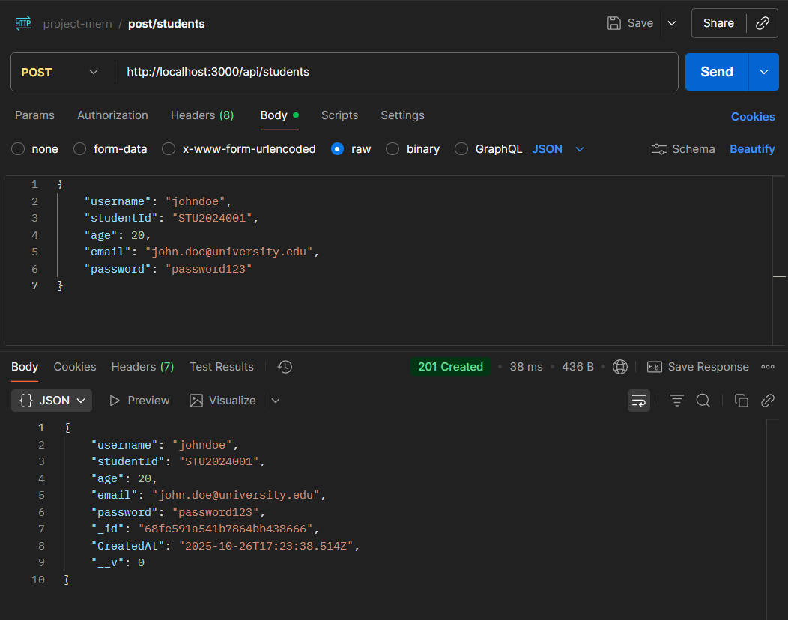

**✅ Test : Créer un étudiant sans studentId (optionnel)**

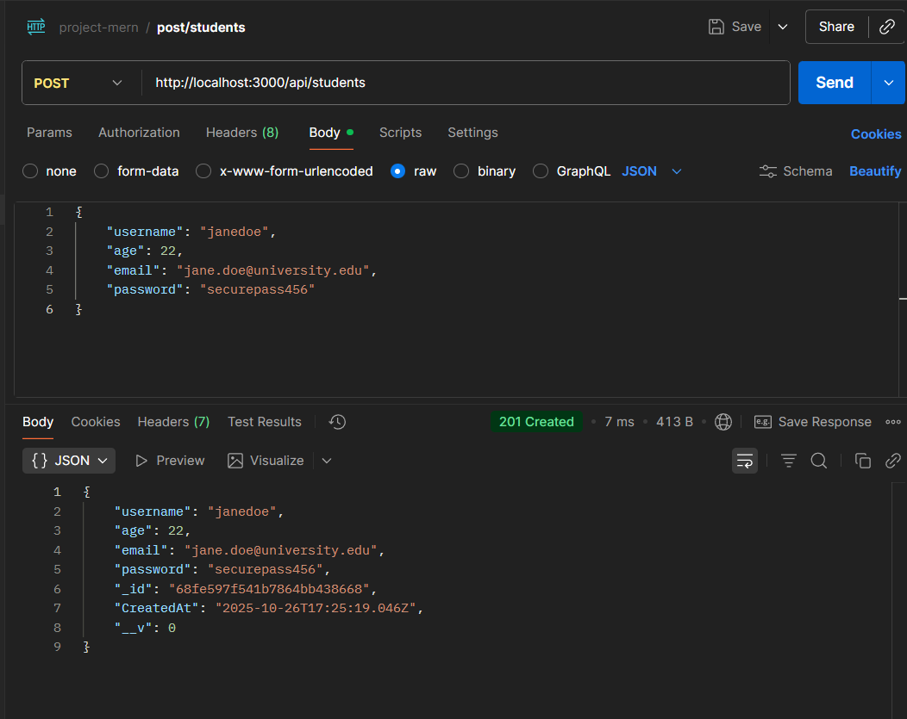

**❌ Test : Créer un étudiant avec username trop court**

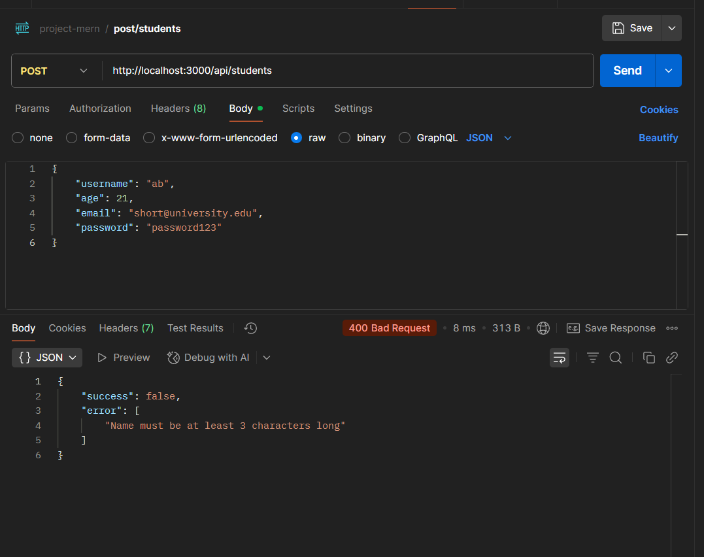

**❌ Test : Créer un étudiant avec email invalide**

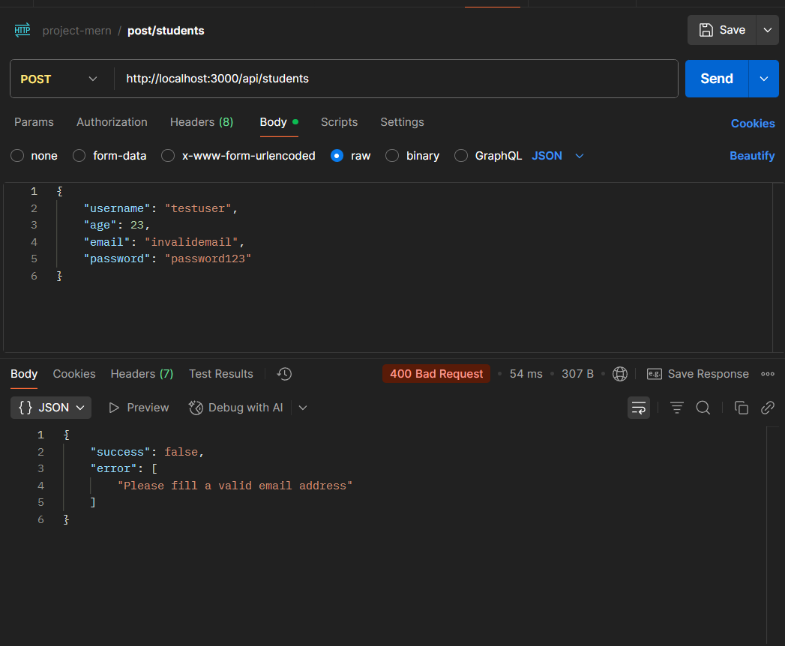

**❌ Test : Créer un étudiant avec champs manquants**


**❌ Test : Créer un étudiant avec username dupliqué**
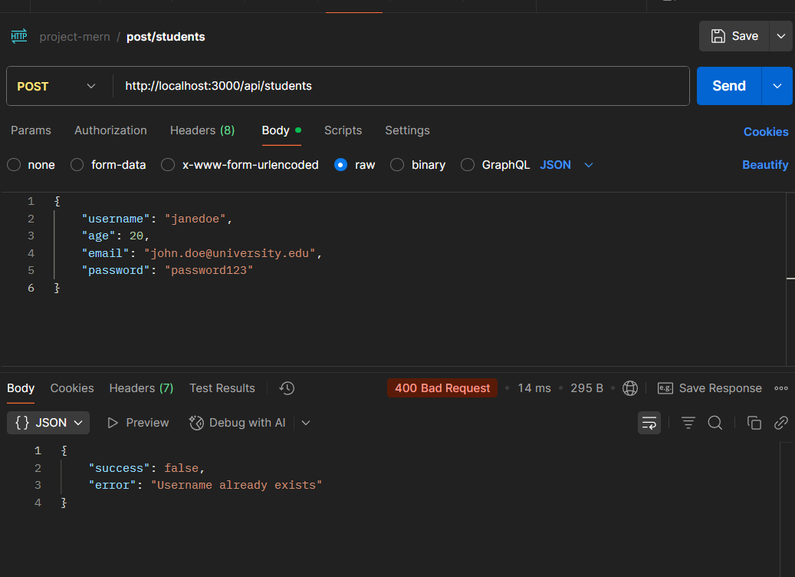

*2. GET ALL STUDENTS - GET /students*

**✅ Test : Récupérer tous les étudiants**

Method: GET

URL: http://localhost:3000/api/students

Expected Response: 200 OK

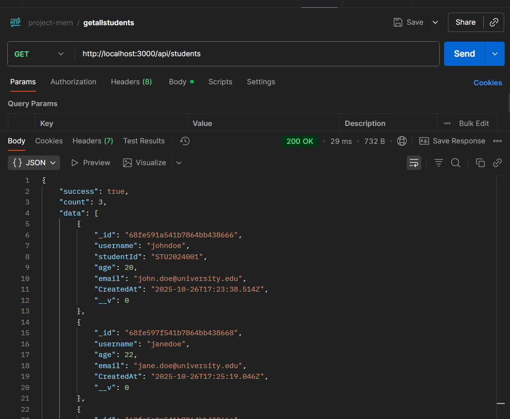

*3. GET STUDENT BY ID - GET /students/:id*

**✅ Test 3.1: Récupérer un étudiant par ID valide**

**Method: GET**

**URL: http://localhost:3000/api/students/{STUDENT_ID}**

Remplacez {STUDENT_ID} par un ID réel d'un étudiant existant.

Expected Response: 200 OK

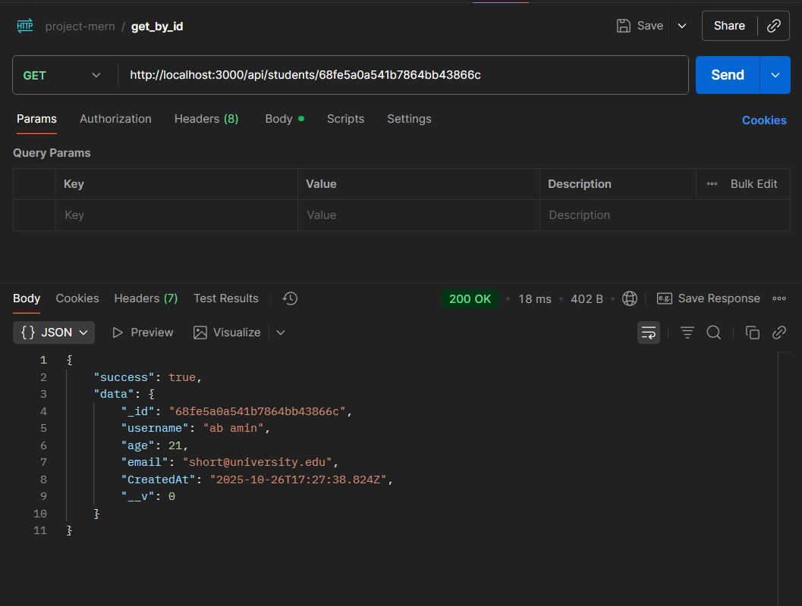

**❌ Test : Récupérer un étudiant avec ID invalide**

**URL:** http://localhost:3000/api/students/invalidid123

Expected Response: 404 Not Found
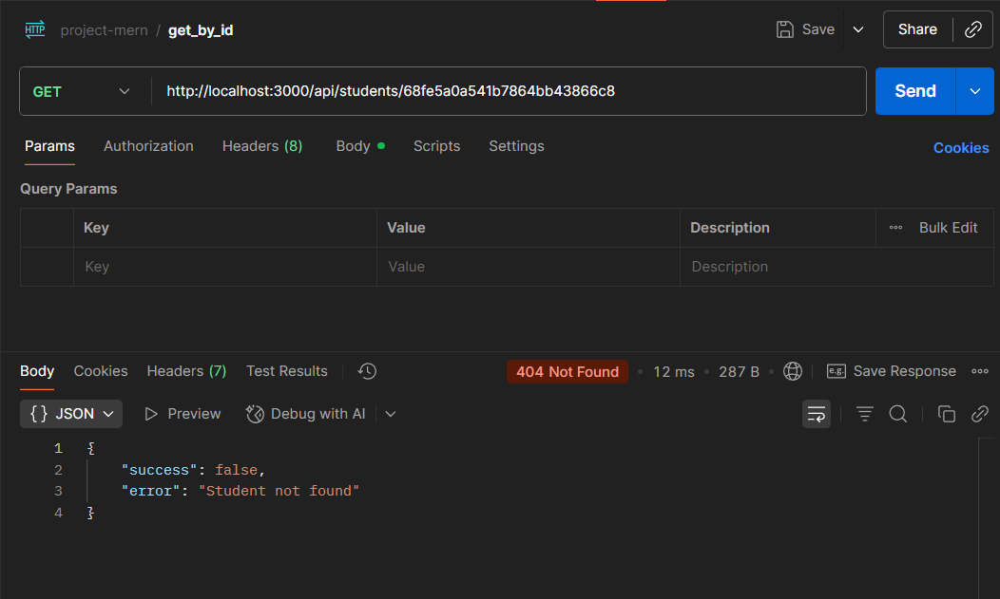


## 4. UPDATE STUDENT - PUT `/students/:id`

### ✅ Test : Mettre à jour complètement un étudiant

**Method:** `PUT`  
**URL:** `http://localhost:3000/api/students/{STUDENT_ID}`  
**Headers:**
```
Content-Type: application/json
```


**✅ Test DELETE: Supprimer un étudiant**
**Method: DELETE**
**URL: http://localhost:3000/api/students/{STUDENT_ID}**

Expected Response: 200 OK

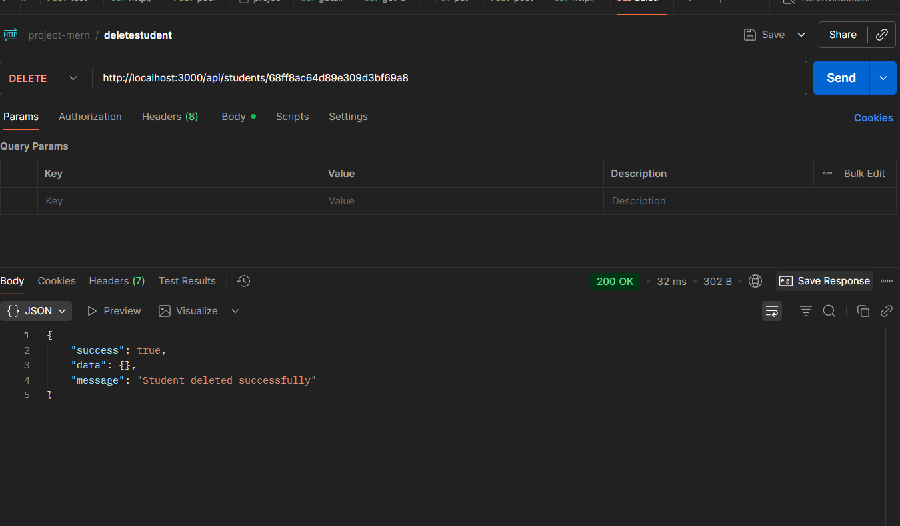


#### Test Course
*1. CREATE COURSE - POST /courses*

**✅ Test 1.1: Créer un cours valide**

**Method: POST**

**URL: http://localhost:3000/api/courses**

**Headers: Content-Type: application/json**

Expected Response: 201 Created
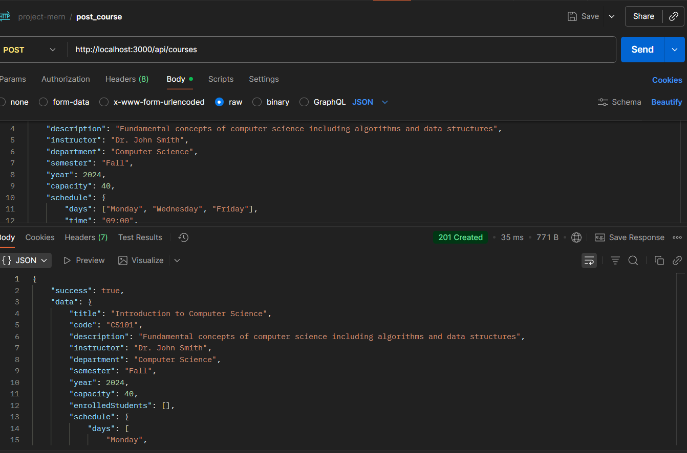

*2. GET ALL COURSES - GET /courses*

**✅ Test : Récupérer tous les cours**

**Method: GET**

**URL: http://localhost:3000/api/courses**

Expected Response: 200 OK

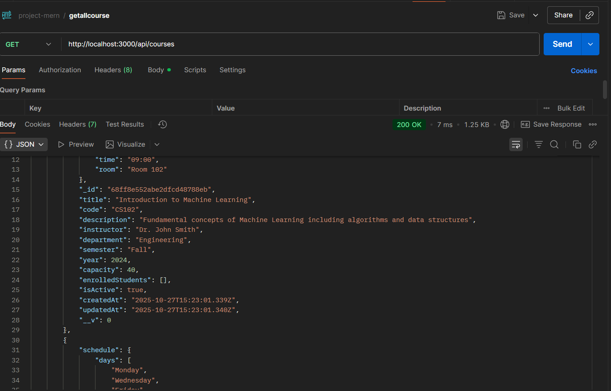

*GET COURSE BY ID - GET /courses/:id*

**✅ Test : Récupérer un cours par ID valide**

**Method: GET**

**URL: http://localhost:3000/api/courses/{COURSE_ID}**

Remplacez {COURSE_ID} par un ID réel d'un cours existant.

Expected Response: 200 OK

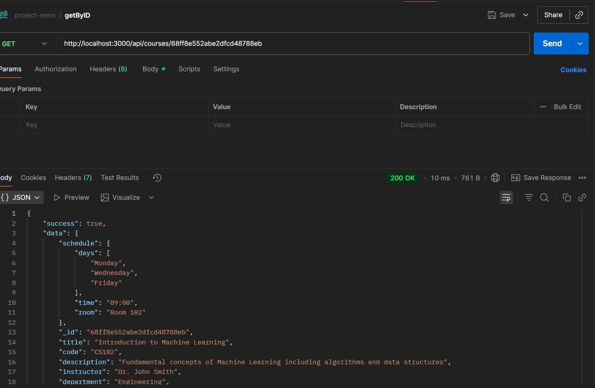

*4. UPDATE COURSE (PUT) - PUT `/courses/:id`*

**✅ Test : Mettre à jour complètement un cours**

**Method:** `PUT`  

**URL:** `http://localhost:3000/api/courses/{COURSE_ID}`  

**Headers:** Content-Type: application/json

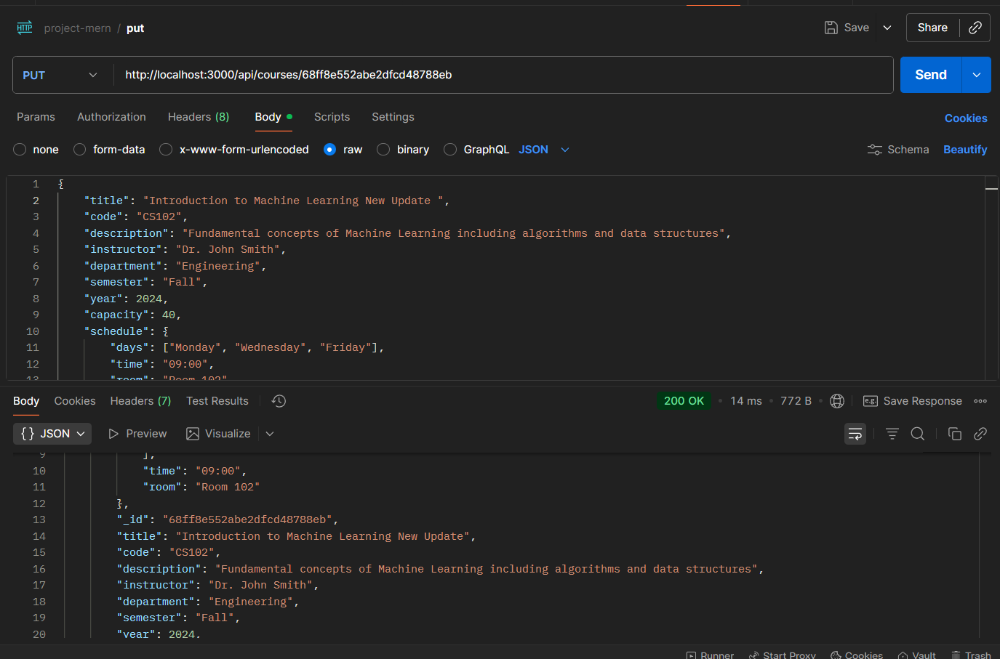


*5. PARTIAL UPDATE (PATCH) - PATCH `/courses/:id`*

**✅ Test 5.1: Mettre à jour partiellement un cours**

**Method:** `PATCH`  

**URL:** `http://localhost:3000/api/courses/{COURSE_ID}`  

**Headers:** Content-Type: application/json

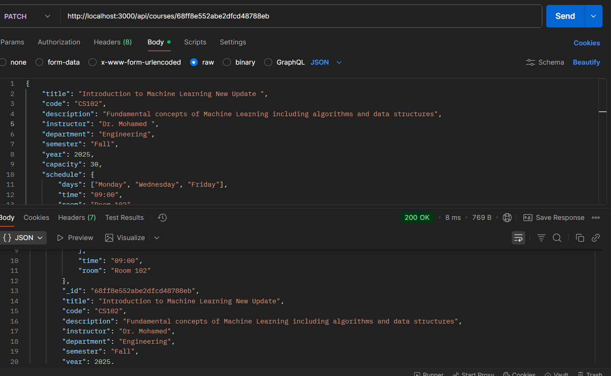

*6. DELETE COURSE - DELETE /courses/:id*

**✅ Test 6.1: Supprimer un cours existant**

**Method: DELETE**

**URL: http://localhost:3000/api/courses/{COURSE_ID}**

Expected Response: 200 OK


---
## 11.📝 Scripts NPM
```bash
    # Lancer en mode développement
    npm run dev

    # Lancer en mode production
    npm start

    # Installer les dépendances
    npm install

    # Mettre à jour les packages
    npm update
```
---
### 12.📚 Ressources Additionnelles

Express Documentation

Mongoose Documentation

MongoDB Documentation

Node.js Documentation

Postman Learning Center

