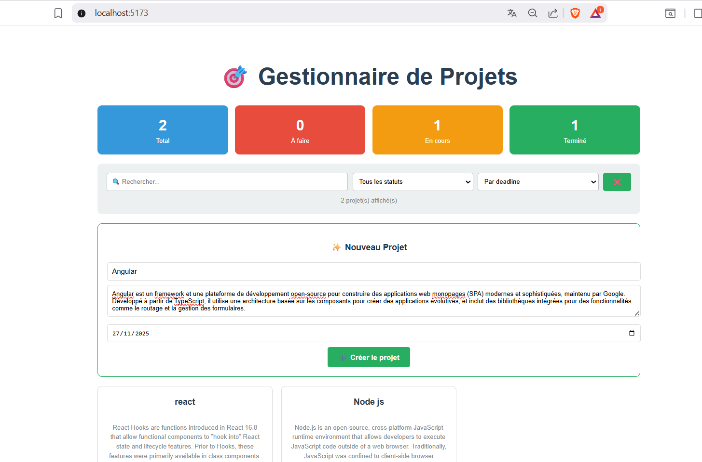
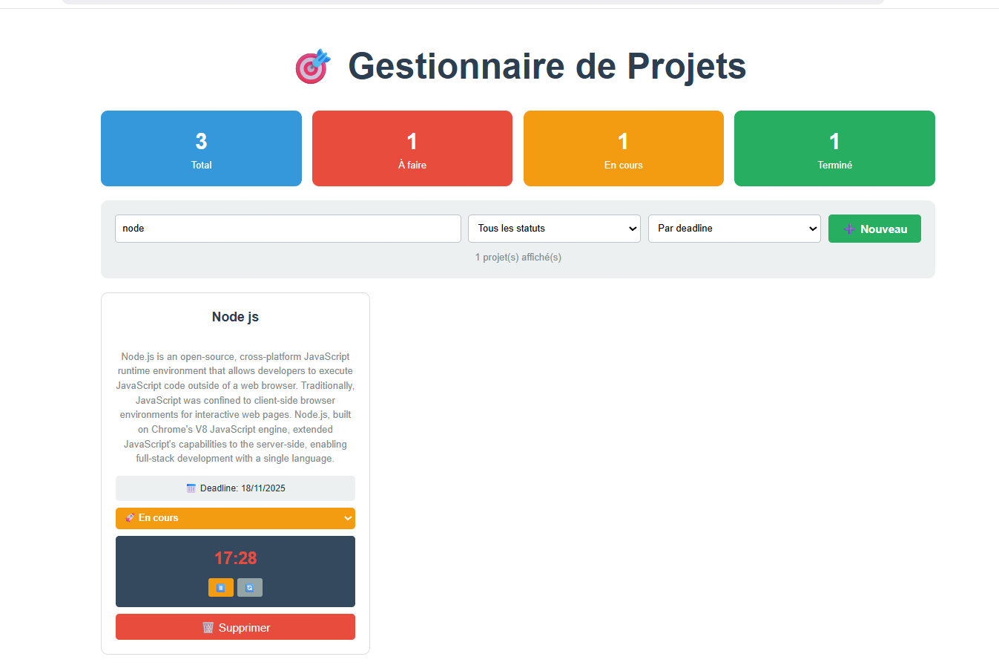
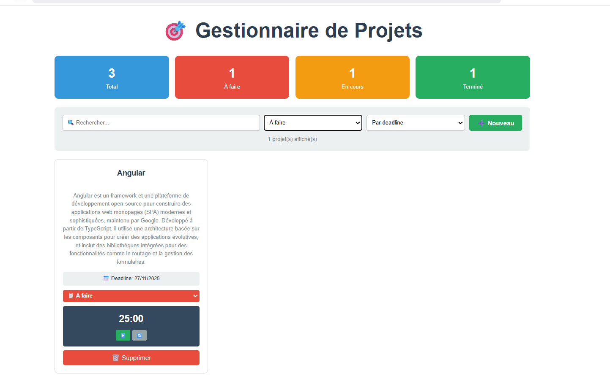
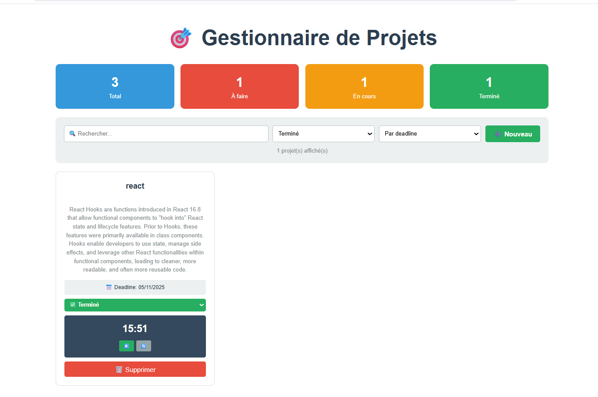
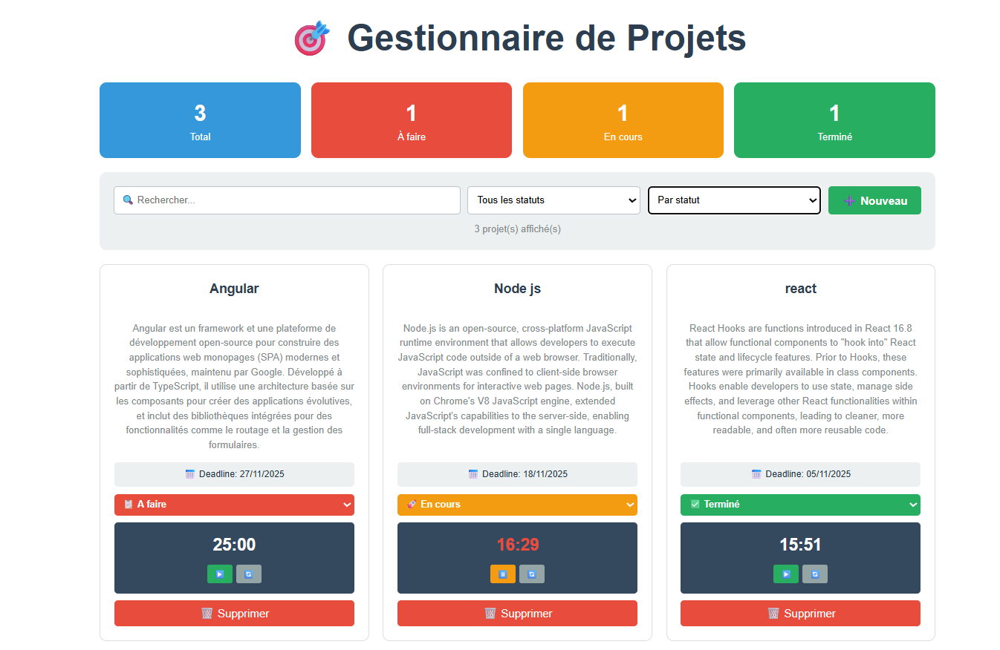
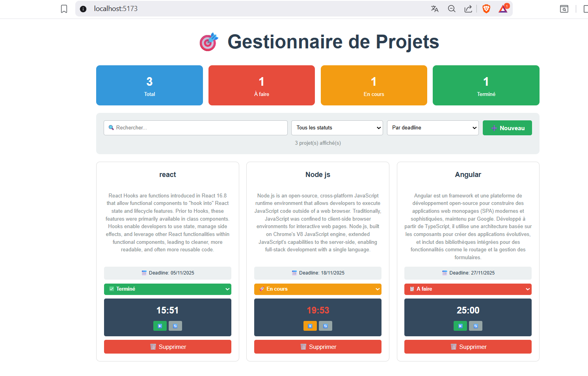

# 📘 README -- Semaine 7 MERN : React Hooks (useState, useEffect, useReducer)

## 🎯 Objectifs de la séance

Cette séance vise à maîtriser les trois hooks fondamentaux de React à
travers des explications théoriques puis plusieurs projets pratiques.

📁 Structure du projet
```bash
REACT2_TP8/
│
├── node_modules/
│
├── public/
│   └── index.html
│
├── src/
│   ├── assets/                # Images utilisées dans le README / projets
│   │
│   ├── components/
│   │   └── ShoppingListApp.jsx
│   │
│   ├── reducers/
│   │   └── todoReducer.js
│   │
│   ├── App.css
│   ├── App.jsx
│   ├── BlogApp.jsx
│   ├── index.css
│   ├── main.jsx
│   └── ProjectManager.jsx     # Projet final complet
│
├── .gitignore
├── eslint.config.js
├── index.html
├── package.json
├── package-lock.json
├── README.md
└── vite.config.js
```

------------------------------------------------------------------------

# 🧠 Partie 1 : Concepts Essentiels

## 🔹 1. useState -- Ajouter un état local

`useState` ajoute de la mémoire à un composant fonctionnel.

Exemples : - `const [count, setCount] = useState(0)` -
`const [items, setItems] = useState([])` -
`const [user, setUser] = useState({ name: "", age: 0 })`

### ✔ Règle d'Or : Immutabilité

❌ Incorrect :

``` js
user.name = "Bob";
setUser(user);
```

✅ Correct :

``` js
setUser({ ...user, name: "Bob" });
setItems([...items, newItem]);
```

------------------------------------------------------------------------

## 🔹 2. useEffect -- Gérer les effets de bord

useEffect permet d'exécuter du code après le rendu.

Trois usages importants : 1. Au montage : `useEffect(() => {...}, [])`
2. Quand une valeur change : `useEffect(() => {...}, [value])` 3. À
chaque rendu : `useEffect(() => {...})`

Utilisations courantes : - Timers - Appels API - localStorage -
Écouteurs d'événements

------------------------------------------------------------------------

## 🔹 3. useReducer -- Gestion d'état complexe

Recommandé lorsque : - plusieurs valeurs d'état sont liées, - les mises
à jour suivent une logique métier structurée.

Exemple :

``` js
const [state, dispatch] = useReducer(reducer, initialState);
dispatch({ type: "ACTION_NAME", payload: data });
```

------------------------------------------------------------------------
# 🧠 Partie 1 : Projets Pratiques
## 🛒 2. Projet 2 -- Liste de Courses avec Timer

*Fonctionnalités* : 
- Ajouter des articles 
- Marquer comme acheté 
- Calcul des prix 
- Timer Pomodoro (25 min) 
- Pause / Reset 
- Persistance
localStorage

*Hooks utilisés* : 
- useState (items et timer) 
- useEffect (stockage + nettoyage des timers)

**Resultat**


**Toutes Liste** 


**Pause**


**Reset**


*✅ Points clés du Projet 2 :*

-  **useState multiple** : Gestion de plusieurs états indépendants (liste, inputs, timer)
-  **useEffect avec cleanup** : Timer avec clearInterval pour éviter les fuites mémoire
-  **useEffect avec dépendances** : Persistance localStorage automatique
-  **Calculs dérivés** : totalPrice et boughtCount calculés à la volée
-  **Inputs contrôlés** : Liaison bidirectionnelle avec value + onChange

------------------------------------------------------------------------

## 📝 3. Projet 1 -- Gestionnaire de Tâches avec useReducer (Todo List)

Fonctionnalités : - Ajouter / compléter / supprimer une tâche - Filtrer
: all / active / completed - Sauvegarde dans localStorage

Architecture : - useReducer pour le reducer - useEffect pour
persistance - useState pour les inputs

**Resultat**


**Toutes Liste**


**Liste Actives**


**Liste Completees**


------------------------------------------------------------------------

## ✍️ 4. Projet 3 -- Blog Interactif avec Tri & Recherche

Fonctionnalités : - Ajouter un article - Rechercher par texte - Filtrer
par auteur - Trier : likes / date - Like / supprimer - Persistance
automatique

Hooks : - useState (multi-états) - useEffect (sauvegarde locale)

**Resultat**


**Filter par recherche**


**Filter par Auteur**


**Ajout d'un course**


------------------------------------------------------------------------

## 🧱 5. Projet Final -- Gestionnaire de Projets

Maintenant, le projet le plus complet qui combine TOUS les concepts :

*Fonctionnalités obligatoires : *
- useReducer : gestion des projets 
- useEffect : timers + persistance 
- useState : formulaires, filtres,recherche 
- Filtrer par statut 
- Trier par deadline 
- Timer Pomodoro par projet - Statistiques

**Ajout Projet**


**Resultat**


**Filter par recherche**



**Filter par les projets à faire**


**Filter par les projets terminées**


**Filter par statut**


**Affichage de gestion du projet**


**Capture Vidéo du resultat**


[👉 Voir la vidéo résultat](src/assets/Project_manager.mp4)
**Supprimer un projet cela afficher dans la vidéo**

------------------------------------------------

## 📚 RÉCAPITULATIF FINAL
✅ Ce que vous avez maintenant :
### Projet 2 - Liste de Courses avec Timer

✅ useState multiple (liste, inputs, timer)

✅ useEffect avec cleanup (timer)

✅ Persistance localStorage

✅ Timer Pomodoro fonctionnel

### Projet 1 - Gestionnaire de Tâches

✅ useReducer pour la logique centralisée

✅ Filtrage (toutes/actives/complétées)

✅ Persistance avec chargement/sauvegarde

✅ Immutabilité stricte

### Projet 3 - Blog Interactif

✅ Recherche multi-critères

✅ Tri dynamique (date/likes)

✅ Filtre par auteur

✅ CRUD complet (Create, Read, Update, Delete)

✅ Initialisation lazy useState

### 🎯 PROJET FINAL - Gestionnaire de Projets
Combine TOUS les hooks :

✅ useReducer : Gestion d'état complexe (projets, filtres, tri)

✅ useEffect :

Persistance localStorage
Timers multiples avec cleanup
Chargement initial


✅ useState : Formulaires, recherche, affichage conditionnel

✅ Statistiques visuelles en temps réel

✅ Timer Pomodoro par projet

✅ Filtrage et tri avancés

✅ Interface moderne en grid layout


### 🎓 Concepts Maîtrisés

| Concept        | Projet 2 | Projet 1 | Projet 3 | Final |
|----------------|----------|----------|----------|--------|
| useState       | ✅        | ✅        | ✅        | ✅      |
| useEffect      | ✅        | ✅        | ✅        | ✅      |
| useReducer     | ❌        | ✅        | ✅        | ❌      |
| Immutabilité   | ✅        | ✅        | ✅        | ✅      |
| localStorage   | ✅        | ✅        | ✅        | ✅      |
| Timer/Cleanup  | ✅        | ❌        | ❌        | ✅      |
| Filtrage       | ✅        | ✅        | ✅        | ✅      |

------------------------------------------------------------------------

## 📚 Ressources

-   React Docs : https://react.dev
-   useState : https://react.dev/reference/react/useState
-   useEffect : https://react.dev/reference/react/useEffect
-   useReducer : https://react.dev/reference/react/useReducer

-----------------

## Auteur 
**Samah SAIDI**