# 📘 README -- Semaine 7 MERN : React Hooks (useState, useEffect, useReducer)

## 🎯 Objectifs de la séance

Cette séance vise à maîtriser les trois hooks fondamentaux de React à
travers des explications théoriques puis plusieurs projets pratiques.

------------------------------------------------------------------------

# 🧠 Partie 1 : Concepts Essentiels

## 🔹 1. useState -- Ajouter un état local

`useState` ajoute de la mémoire à un composant fonctionnel.

Exemples : - `const [count, setCount] = useState(0)` -
`const [items, setItems] = useState([])` -
`const [user, setUser] = useState({ name: "", age: 0 })`

### ✔ Règle d'Or : Immutabilité

❌ Incorrect :

``` js
user.name = "Bob";
setUser(user);
```

✅ Correct :

``` js
setUser({ ...user, name: "Bob" });
setItems([...items, newItem]);
```

------------------------------------------------------------------------

## 🔹 2. useEffect -- Gérer les effets de bord

useEffect permet d'exécuter du code après le rendu.

Trois usages importants : 1. Au montage : `useEffect(() => {...}, [])`
2. Quand une valeur change : `useEffect(() => {...}, [value])` 3. À
chaque rendu : `useEffect(() => {...})`

Utilisations courantes : - Timers - Appels API - localStorage -
Écouteurs d'événements

------------------------------------------------------------------------

## 🔹 3. useReducer -- Gestion d'état complexe

Recommandé lorsque : - plusieurs valeurs d'état sont liées, - les mises
à jour suivent une logique métier structurée.

Exemple :

``` js
const [state, dispatch] = useReducer(reducer, initialState);
dispatch({ type: "ACTION_NAME", payload: data });
```

------------------------------------------------------------------------
# 🧠 Partie 1 : Projets Pratiques
## 🛒 2. Projet 2 -- Liste de Courses avec Timer

*Fonctionnalités* : 
- Ajouter des articles 
- Marquer comme acheté 
- Calcul des prix 
- Timer Pomodoro (25 min) 
- Pause / Reset 
- Persistance
localStorage

*Hooks utilisés* : 
- useState (items et timer) 
- useEffect (stockage + nettoyage des timers)

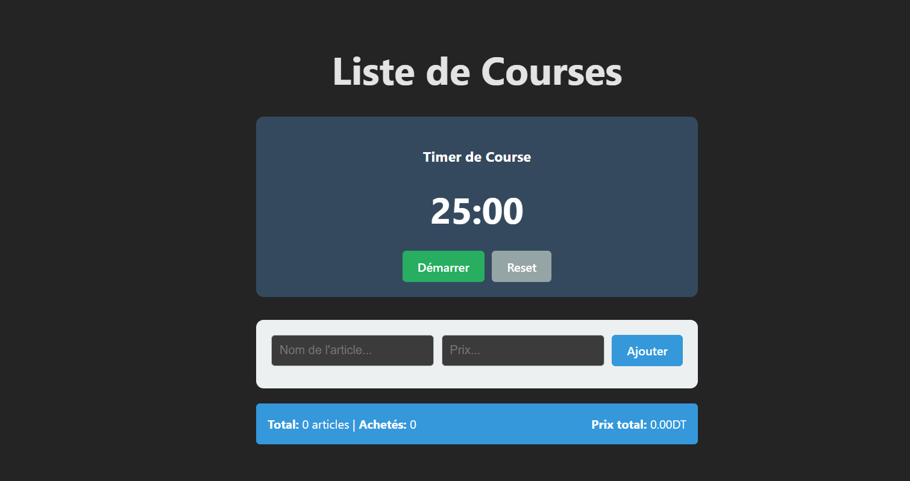

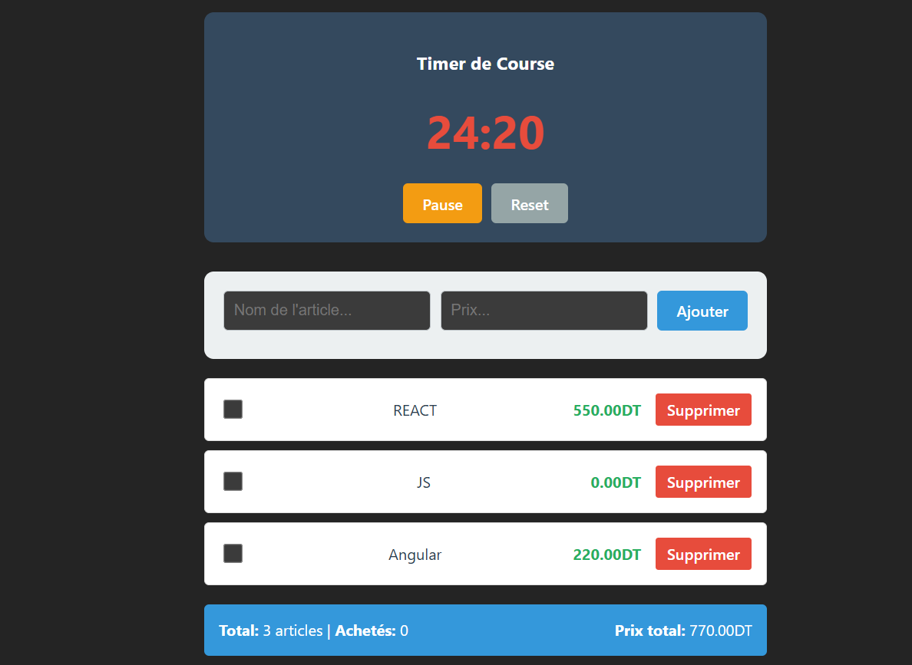

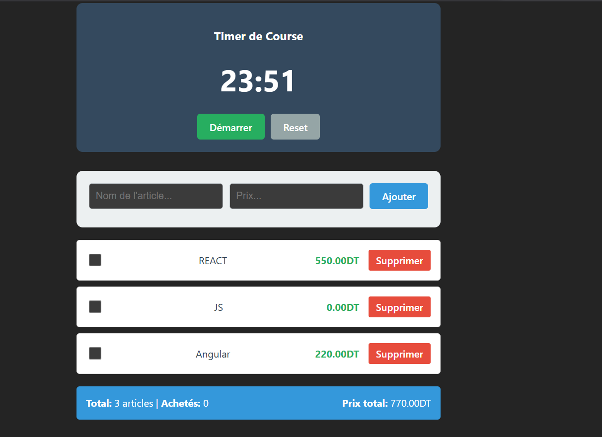

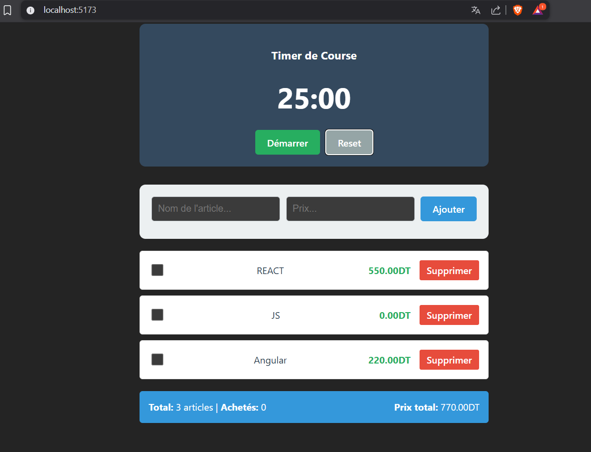

*✅ Points clés du Projet 2 :*

-  **useState multiple** : Gestion de plusieurs états indépendants (liste, inputs, timer)
-  **useEffect avec cleanup** : Timer avec clearInterval pour éviter les fuites mémoire
-  **useEffect avec dépendances** : Persistance localStorage automatique
-  **Calculs dérivés** : totalPrice et boughtCount calculés à la volée
-  **Inputs contrôlés** : Liaison bidirectionnelle avec value + onChange

------------------------------------------------------------------------

## 📝 3. Projet 1 -- Gestionnaire de Tâches avec useReducer (Todo List)

Fonctionnalités : - Ajouter / compléter / supprimer une tâche - Filtrer
: all / active / completed - Sauvegarde dans localStorage

Architecture : - useReducer pour le reducer - useEffect pour
persistance - useState pour les inputs

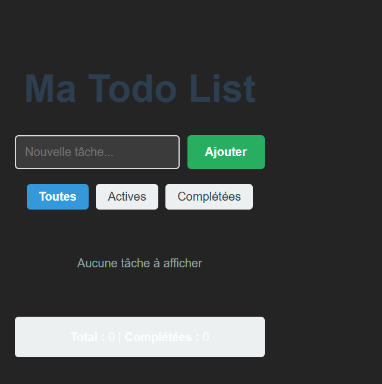

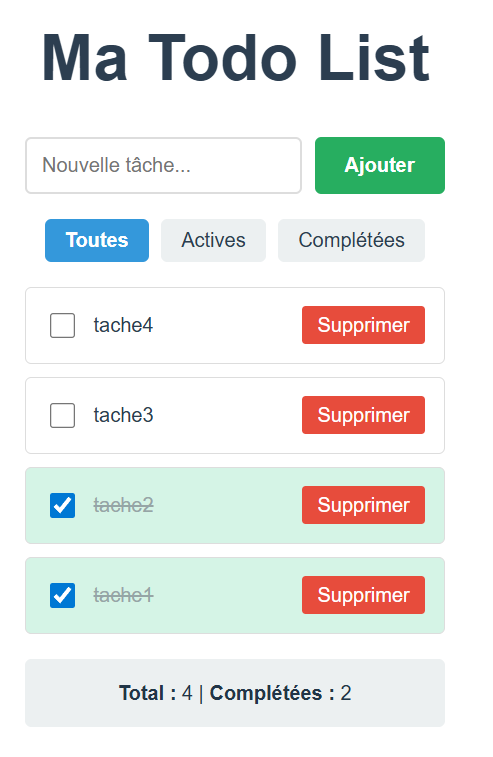

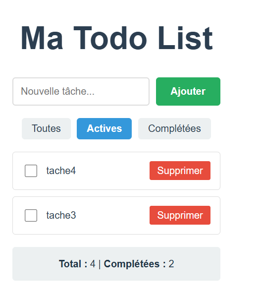

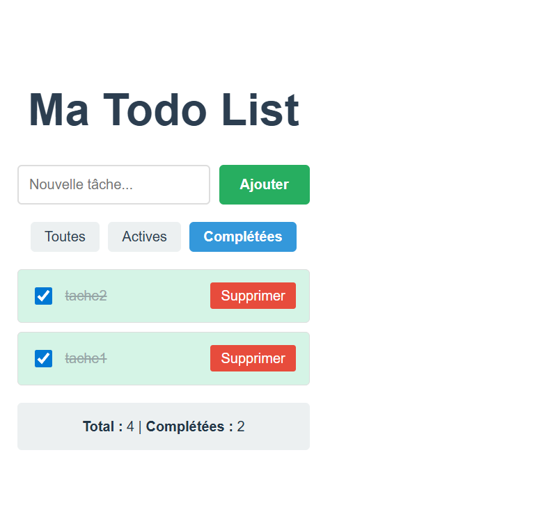

------------------------------------------------------------------------

## ✍️ 4. Projet 3 -- Blog Interactif avec Tri & Recherche

Fonctionnalités : - Ajouter un article - Rechercher par texte - Filtrer
par auteur - Trier : likes / date - Like / supprimer - Persistance
automatique

Hooks : - useState (multi-états) - useEffect (sauvegarde locale)

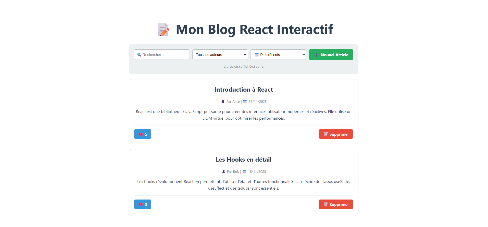

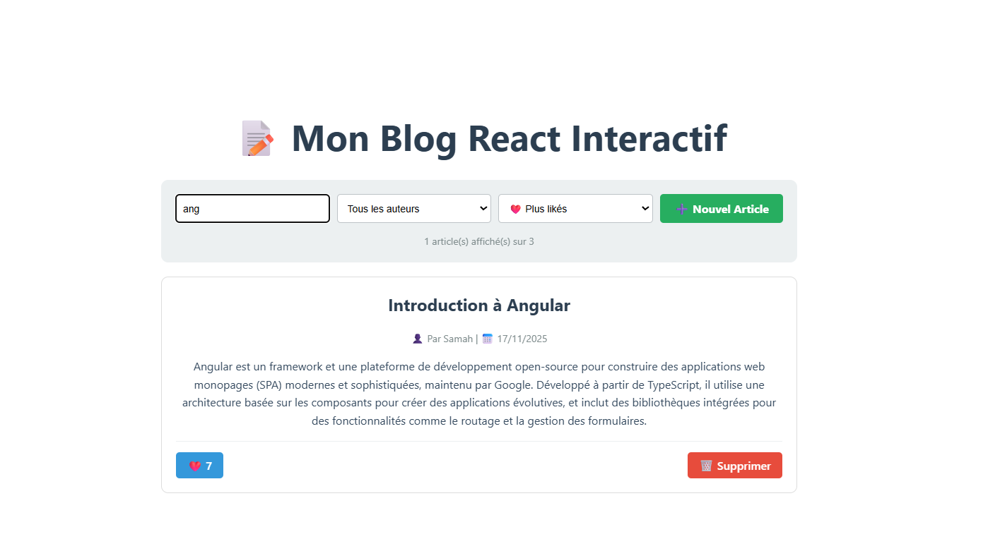

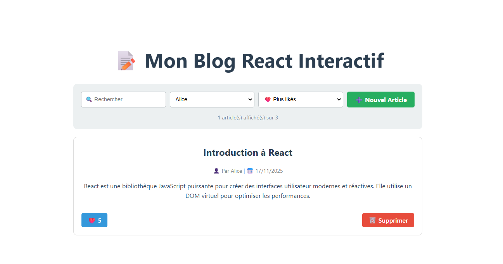

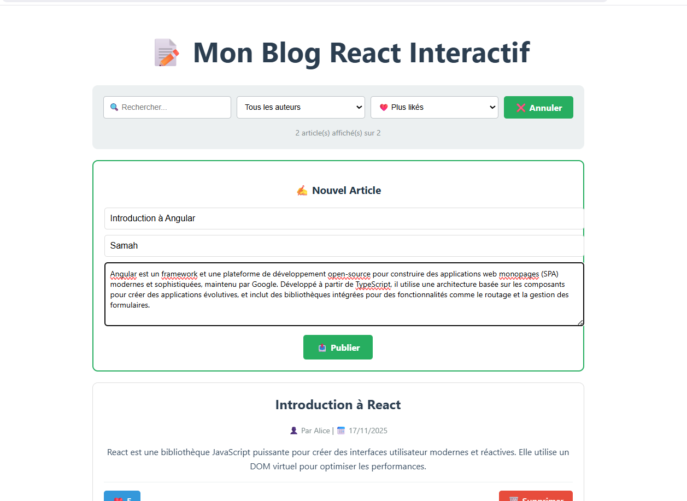

------------------------------------------------------------------------

## 🧱 5. Projet Final -- Gestionnaire de Projets

*Fonctionnalités obligatoires : *
- useReducer : gestion des projets 
- useEffect : timers + persistance 
- useState : formulaires, filtres,recherche 
- Filtrer par statut 
- Trier par deadline 
- Timer Pomodoro par projet - Statistiques


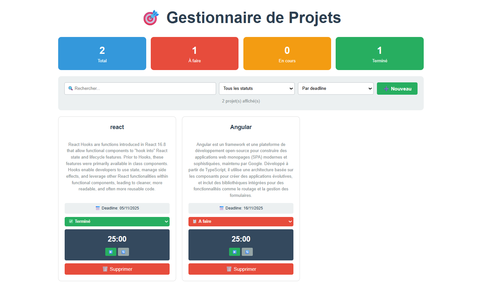

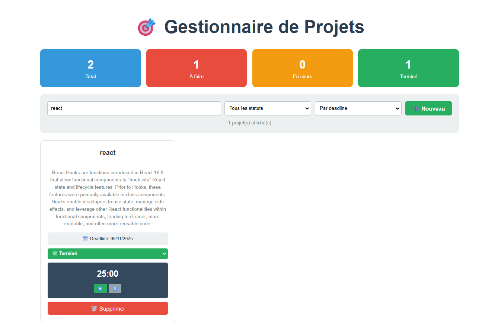

[👉 Voir la vidéo résultat](src/assets/Project_manager.mp4)
------------------------------------------------------------------------

## 📚 Ressources

-   React Docs : https://react.dev
-   useState : https://react.dev/reference/react/useState
-   useEffect : https://react.dev/reference/react/useEffect
-   useReducer : https://react.dev/reference/react/useReducer
